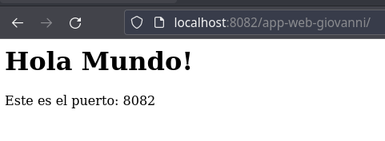

# **Balanceo de carga en Apache**

## **Índice**
[Activación de módulos](#id1)<br>
[Configuración Apache](#id2)<br>
[Creación del proyecto](#id3)<br>
[Verificación](#id4)

## **Activación de los módulos**<a name = "id1"></a>
Lo primero que haremos será activar los módulos necesarios para el balanceo.

```bash
daw@budgie21:~$ sudo a2enmod proxy
Enabling module proxy.
```

```bash
daw@budgie21:~$ sudo a2enmod proxy_http
Considering dependency proxy for proxy_http:
Module proxy already enabled
Enabling module proxy_http.
```

```bash
daw@budgie21:~$ sudo a2enmod proxy_ajp
Considering dependency proxy for proxy_ajp:
Module proxy already enabled
Enabling module proxy_ajp.
```

```bash
daw@budgie21:~$ sudo a2enmod rewrite
Enabling module rewrite.
```

```bash
daw@budgie21:~$ sudo a2enmod deflate
Considering dependency filter for deflate:
Module filter already enabled
Module deflate already enabled
```

```bash
daw@budgie21:~$ sudo a2enmod headers
Enabling module headers.
```

```bash
daw@budgie21:~$ sudo a2enmod proxy_balancer
Considering dependency proxy for proxy_balancer:
Module proxy already enabled
Considering dependency alias for proxy_balancer:
Module alias already enabled
Considering dependency slotmem_shm for proxy_balancer:
Enabling module slotmem_shm.
Enabling module proxy_balancer.
```

```bash
daw@budgie21:~$ sudo a2enmod proxy_connect
Considering dependency proxy for proxy_connect:
Module proxy already enabled
Enabling module proxy_connect.
```

```bash
daw@budgie21:~$ sudo a2enmod proxy_html
Considering dependency proxy for proxy_html:
Module proxy already enabled
Considering dependency xml2enc for proxy_html:
Enabling module xml2enc.
Enabling module proxy_html.
```

```bash
daw@budgie21:~$ sudo a2enmod lbmethod_byrequests
Considering dependency proxy_balancer for lbmethod_byrequests:
Considering dependency proxy for proxy_balancer:
Module proxy already enabled
Considering dependency alias for proxy_balancer:
Module alias already enabled
Considering dependency slotmem_shm for proxy_balancer:
Module slotmem_shm already enabled
Module proxy_balancer already enabled
Enabling module lbmethod_byrequests.
```

Para que todos los módulos instalados entren en funcionamiento tenemos que reiniciar Apache.

```bash
daw@budgie21:~$ sudo systemctl restart apache2
```

## **Configuración de Apache**<a name = "id2"></a>
En este paso editamos el fichero **000-default.conf** y añadiremos las siguientes directivas.

```bash
<Proxy balancer://mycluster>
                #Server 1
                BalancerMember http://localhost:8080
                #Server 2
                BalancerMember http://localhost:8081
                #Server 3
                BalancerMember http://localhost:8082
                #Server 4
                BalancerMember http://localhost:8083
        </Proxy>
        ProxyPass / balancer://mycluster/
```

## **Creación del proyecto**<a name = "id3"></a>
Ahora crearemos el proyecto, para ello creamos el fichero **Dockerfile**.

```bash
FROM jboss/wildfly

#COPY targer/app-web-demo.war app-web-demo.war

ARG WAR_FILE=target/*.war
##COPY ${JAR_FILE} app.jar

ADD ${ARG} /opt/jboss/wildfly/standalone/deployments/

ARG WILDFLY_NAME
ARG CLUSTER_PW

ENV WILDFLY_NAME=${WILDFLY_NAME}
ENV CLUSTER_PW=${CLUSTER_PW}

ENTRYPOINT /opt/jboss/wildfly/bin/standalone.sh -b=0.0.0.0 -bmanagement=0.0.0.0 -Djboss.server.default.config=standalone-full-ha.xml -Djboss.node.name=${WILDFLY_NAME} -Djava.net.preferIPv4Stack=true -Djgroups.bind_addr=$(hostname -i) -Djboss.messaging.cluster.password=${CLUSTER_PW}
```

Creamos el fichero **docker-compose.yml**.

```bash
version: '3.5'
services:

  wildfly1:
    build:
      context: .
      args:
        WILDFLY_NAME: wildfly_1
        CLUSTER_PW: secret_password
    image: wildfly_1
    ports:
      - 8081:8080
    networks:
      wildfly_network:

  wildfly2:
    build:
      context: .
      args:
        WILDFLY_NAME: wildfly_2
        CLUSTER_PW: secret_password
    image: wildfly_2
    ports:
      - 8082:8080
    networks:
      wildfly_network:

  wildfly3:
    build:
      context: .
      args:
        WILDFLY_NAME: wildfly_3
        CLUSTER_PW: secret_password
    image: wildfly_3
    ports:
      - 8083:8080
    networks:
      wildfly_network:

  wildfly4:
    build:
      context: .
      args:
        WILDFLY_NAME: wildfly_4
        CLUSTER_PW: secret_password
    image: wildfly_4
    ports:
      - 8084:8080
    networks:
      wildfly_network:

networks:
  wildfly_network:
    ipam:
      driver: default
```

## **Verificación**<a name = "id4"></a>
Para verificar abrimos un navegador y escribimos **http://localhost/app-web-giovanni** y veremos lo siguiente:



Si refrescamos la página, cambiaremos el puerto.

