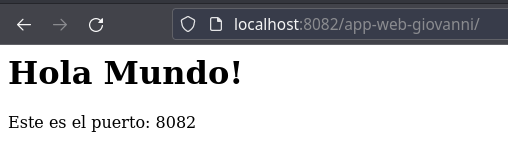
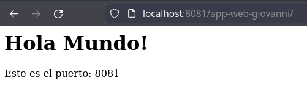
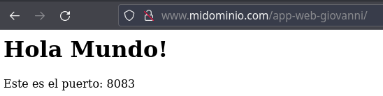

# **Balanceo de carga en Nginx**

## **Índice**
[Configuración de dominio en Nginx](#id1)<br>
[Verificación](#id2)

## **Configuración de dominio en Nginx**<a name = "id1"></a>
Crearemos un fichero llamado **midominio.conf** en la ruta **/etc/nginx/sites-availables** con lo siguiente:

```bash
server {
  #Escucha en el puerto 8090, ipv4.
  listen 8090;

  #Aquí deberás introducir el nombre de tu dominio.
  server_name www.midominio.com;

  access_log            /var/log/nginx/midominio.com.access.log;

  location / {
      #La configuración del proxy.
      proxy_pass http://localhost:8082/app-web-giovanni;
  }
}
```

Luego de esto reiniciaremos el servicio de Nginx.

```bash
daw@budgie21:~$ sudo systemctl restart nginx
```

Accederemos ahora a **www.midominio.com** y veremos que nos muestra.



Ahora vamos a añadir más configuración al fichero.

```bash
http {
    upstream server_group_wildfly {
        least_conn;
        server http://localhost:8080/app-web-giovanni/;
        server http://localhost:8081/app-web-giovanni/;
        server http://localhost:8082/app-web-giovanni/;
        server http://localhost:8083/app-web-giovanni/ backup;
    }

    server {
        location / {
            proxy_pass http://server_group_wildfly;
        }
    }
```

Volvemos a reiniciar el servicio.

```bash
daw@budgie21:~$ sudo systemctl restart nginx
```

## **Verificación**<a name = "id2"></a>
Para verificar el funcionamiento, abrimos un navegador y escribimos **http://www.midominio.com/app-web-giovanni** y tendremos que ver lo siguiente.





