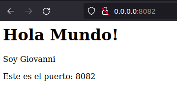
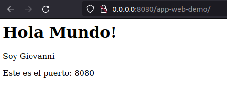
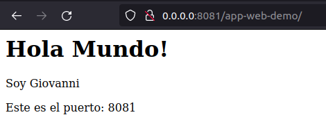

# **Clusterizando una app en WildFly**

## **Índice**
[Desplegando un Cluster de JBOSS con Docker](#id1)

## **Desplegando un Cluster de JBOSS con Docker**<a name = "id1"></a>
Lo primero que haremos será descargar **Docker compose**.

```bash
daw@DLP17-Lubuntu18:~$ sudo curl -L "https://github.com/docker/compose/releases/download/1.29.2/docker-compose-$(uname -s)-$(uname -m)" -o /usr/local/bin/docker-compose
[sudo] contraseña para daw: 
  % Total    % Received % Xferd  Average Speed   Time    Time     Time  Current
                                 Dload  Upload   Total   Spent    Left  Speed
100   633  100   633    0     0   2117      0 --:--:-- --:--:-- --:--:--  2117
100 12.1M  100 12.1M    0     0  12.2M      0 --:--:-- --:--:-- --:--:-- 29.2M
```

Le damos permisos de **ejecución**.

```bash
daw@DLP17-Lubuntu18:~$ sudo chmod +x /usr/local/bin/docker-compose
```

Creamos el enlace simbólico.

```bash
daw@DLP17-Lubuntu18:~$ sudo ln -s /usr/local/bin/docker-compose /usr/bin/docker-compose
```

Por último verificaremos.

```bash
daw@DLP17-Lubuntu18:~$ docker-compose --version
docker-compose version 1.29.2, build 5becea4c
```

Ahora nos descargaremos el proyecto y cambiaremos las siguiente línea del fichero **web.xml**.

```bash
<display-name>app-web-giovanni</display-name>
```

Y lanzamos el siguiente comando.

```bash
daw@DLP17-Lubuntu18:~/Desktop/app-web-demo$ mvn clean install
```

Si todo ha salido correctamente, veremos lo siguiente:

```bash
[INFO] ------------------------------------------------------------------------
[INFO] BUILD SUCCESS
[INFO] ------------------------------------------------------------------------
[INFO] Total time:  1.369 s
[INFO] Finished at: 2021-11-08T17:45:02Z
[INFO] ------------------------------------------------------------------------
```

Ahora construiremos el fichero **Dockerfile**.

```bash
FROM jboss/wildfly

#COPY targer/app-web-demo.war app-web-demo.war 

ARG WAR_FILE=target/*.war
##COPY ${JAR_FILE} app.jar

ADD ${ARG} /opt/jboss/wildfly/standalone/deployments/

ARG WILDFLY_NAME
ARG CLUSTER_PW

ENV WILDFLY_NAME=${WILDFLY_NAME}
ENV CLUSTER_PW=${CLUSTER_PW}


ENTRYPOINT /opt/jboss/wildfly/bin/standalone.sh -b=0.0.0.0 -bmanagement=0.0.0.0 -Djboss.server.default.config=standalone-full-ha.xml -Djboss.node.name=${WILDFLY_NAME} -Djava.net.preferIPv4Stack=true -Djgroups.bind_addr=$(hostname -i) -Djboss.messaging.cluster.password=${CLUSTER_PW}
```

Ahora lanzamos **mvn clear jetty:run** para ver si funciona localmente.



Ahora lo vamos a probar en el servidor, para ello lanzamos el comando **docker-compose up -d**.

Si todo funciona correctamente, en el navegador escribimos **0.0.0.0:8080/app-web-demo/**, y veremos lo siguiente:



Y **0.0.0.0:8081/app-web-demo/** veremos lo siguiente:

