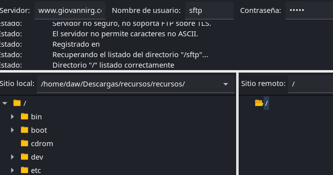
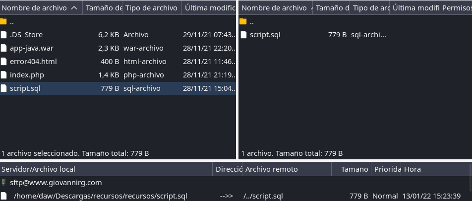

# **Construcción de un servicio de empresa**

## **Índice**
[Estructura del proyecto](#id1)<br>
[Creación del dominio principal](#id2)<br>
[Creación del subdominio PhpMyAdmin](#id3)<br>
[Creación del subdominio SFTP](#id4)<br>

## **Estructura del proyecto**<a name = "id1"></a>
Lo primero será hacer la estructura de carpetas del proyecto, que será la siguiente:

```bash
daw@budgie21:~$ tree /var/www/giovannirg/
/var/www/giovannirg/
├── index.php
├── phpmyadmin
└── sftp

2 directories, 1 file
```

## **Creación del dominio principal**<a name = "id2"></a>
Ahora lo que haremos será crear el dominio principal, para ello iremos al directorio **/etc/apache2/sites-available/** y crearemos el fichero **giovannirg.conf** con lo siguiente.


Lo siguiente será ir al fichero **hosts** situado en **/etc** y añadir la ip de nuestro servidor con el dominio que anteriormente definimos en el fichero de configuración.

```bash
127.0.1.1       www.giovannirgsystem.com
```

Luego tendremos que crear el fichero **index.php**, en la ruta **/var/www/giovannirg**, que es la que definimos en la configuración.

```bash
<html>
   <head>
     <title>Giovanni System Home</title>
   </head>
   <body>
     <?php echo '<p>Pagina inicial de Giovanni System </p>'; ?>
   </body>
</html>
```

Por último abrimos un navegador y probaremos el dominio.


# **Creación del subdominio PhpMyAdmin**<a name = "id3"></a>
Ahora haremos lo mismo que en paso anterior, crearemos un fichero de configuración, lo único que ahora tendremos que añadir un **Alias** para que el servidor acceda a dicho subdominio.


Crearemos un directorio en la estructura del proyecto.

Por último comprobaremos su funcionamiento en el navegador, lo primero nos pedirá logear.


Si nos logeamos correctamente, veremos las bases de datos.


## **Creación del subdominio SFTP**<a name = "id4"></a>
Como hemos hecho en el punto anterior, lo primero que haremos será crear el fichero de configuración con el **Alias** del subdominio.


Ahora usaremos **FileZilla** para comprobar la conexión.



Por último vamos a transferir un fichero para comprobar la transferencia de ficheros.

