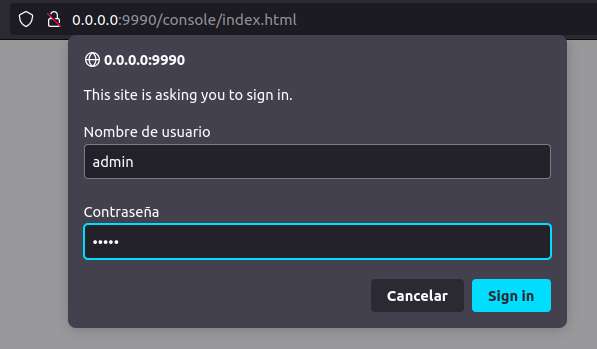
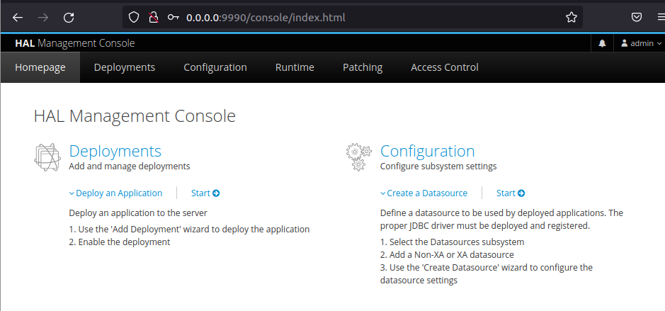

# **Dokeriza tu Wildfly**

## **Índice**
[Creación del fichero dockerfile para Wildfly](#id1)<br>
[Uso de la nueva imagen](#id2)


## **Creación del fichero dockerfile para Wildfly**<a name = "id1"></a>
Lo primero que haremos será crear el directorio de trabajo y movernos a ella.

```bash
daw@DLP17-Lubuntu18:~$ mkdir wildfly-config
daw@DLP17-Lubuntu18:~$ cd wildfly-config/
```

Creamos el fichero de configuración.

```bash
daw@DLP17-Lubuntu18:~/wildfly-config$ nano Dockerfile
```

Añadimos la configuración de nuestra imagen.

```bash
# Base image
FROM jboss/wildfly:25.0.0.Final

# Maintainer
MAINTAINER "giovanni"

# Create user admin with password admin
RUN /opt/jboss/wildfly/bin/add-user.sh admin admin --silent

# Add custom configuration file
# ADD standalone.xml /opt/jboss/wildfly/standalone/configuration/

# Add example.war to deployments
# ADD example.war /opt/jboss/wildfly/standalone/deployments/

# JBoss ports
EXPOSE 8080 9990 8009

# Run
CMD ["/opt/jboss/wildfly/bin/standalone.sh", "-b", "0.0.0.0", "-bmanagement", "0.0.0.0", "-c", "standalone.xml"]
```

Construimos la imagen que usaremos.

```bash
daw@DLP17-Lubuntu18:~/wildfly-config$ sudo docker build -q --rm --tag=jboss/wildfly:25.0.0.Final-config .
sha256:53c2261a405f0914d98aaaba4914b25def0671c1bab46e6dccebfbf6fcf0b458
```

Verificamos si la imagen existe en Docker.

```bash
daw@DLP17-Lubuntu18:~/wildfly-config$ sudo docker images
REPOSITORY      TAG                   IMAGE ID       CREATED          SIZE
jboss/wildfly   25.0.0.Final-config   53c2261a405f   37 seconds ago   736MB
jboss/wildfly   25.0.0.Final          856694040847   4 weeks ago      736MB
jboss/wildfly   latest                856694040847   4 weeks ago      736MB
hello-world     latest                feb5d9fea6a5   5 weeks ago      13.3kB
```

## **Uso de la nueva imagen**<a name = "id2"></a>
Ahora probaremos la imagen que acabamos de crear.

```bash
daw@DLP17-Lubuntu18:~/wildfly-config$ sudo docker run -d -p 8080:8080 -p 9990:9990 -p 8009:8009 --name servidor-wilfly-config -it jboss/wildfly:25.0.0.Final-config
97b7cdf8fa5766cb7f67d58ee3b2ab23f036853923266e5eab3c62cb6ccfe941
```

Una vez arrancada, verficamos que el contenedor está arrancado.

```bash
daw@DLP17-Lubuntu18:~/wildfly-config$ sudo docker ps -a
CONTAINER ID   IMAGE                               COMMAND                  CREATED              STATUS                    PORTS                                                                                                                             NAMES
97b7cdf8fa57   jboss/wildfly:25.0.0.Final-config   "/opt/jboss/wildfly/…"   About a minute ago   Up About a minute         0.0.0.0:8009->8009/tcp, :::8009->8009/tcp, 0.0.0.0:8080->8080/tcp, :::8080->8080/tcp, 0.0.0.0:9990->9990/tcp, :::9990->9990/tcp   servidor-wilfly-config
```

Por último vamos a probar si funciona correctamente, abrimos un navegador y escribiremos **0.0.0.0:9990**, nos logearemos con el usuario.



Si el login es correcto, veremos lo siguiente:


