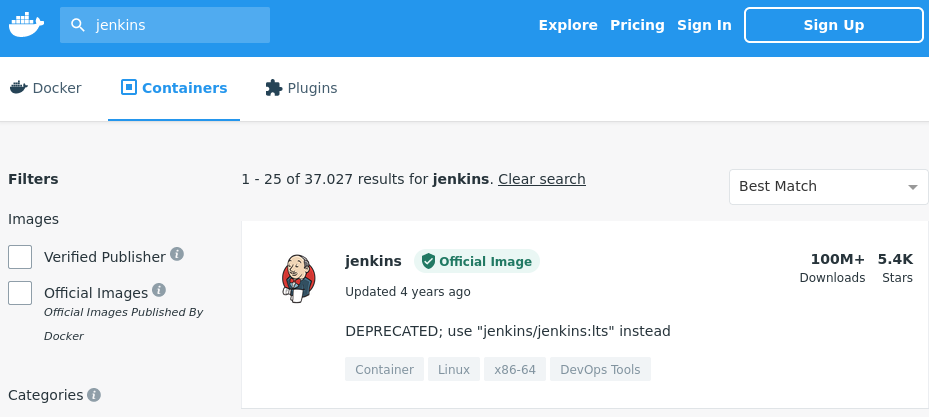
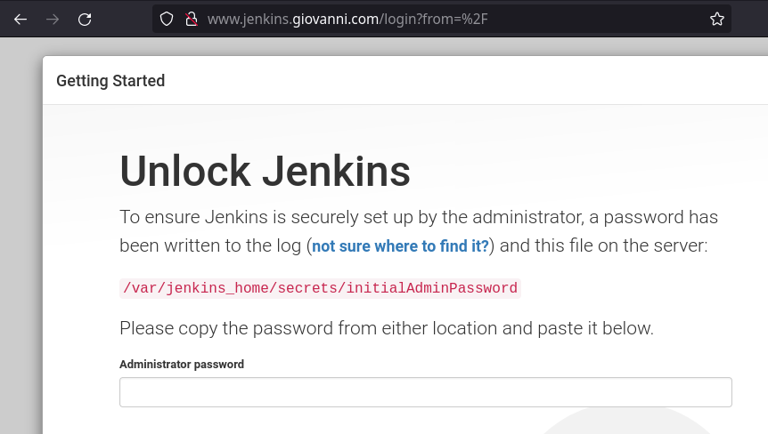
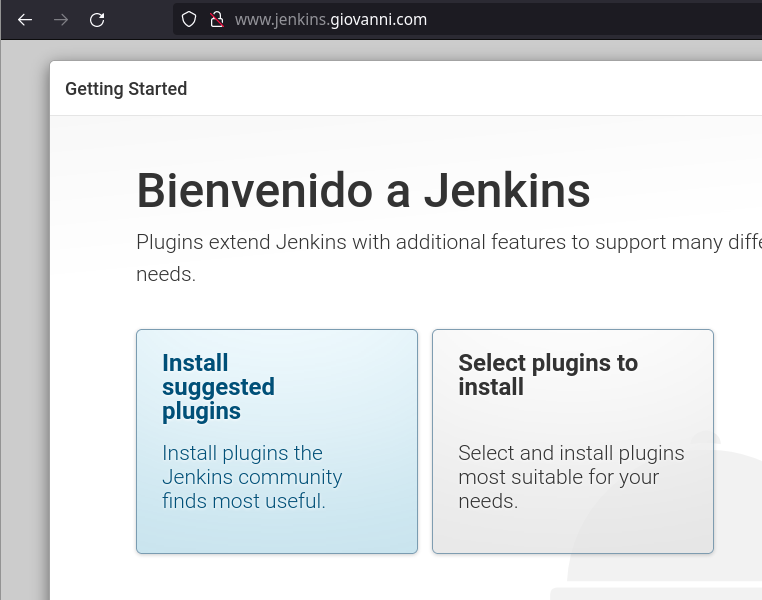
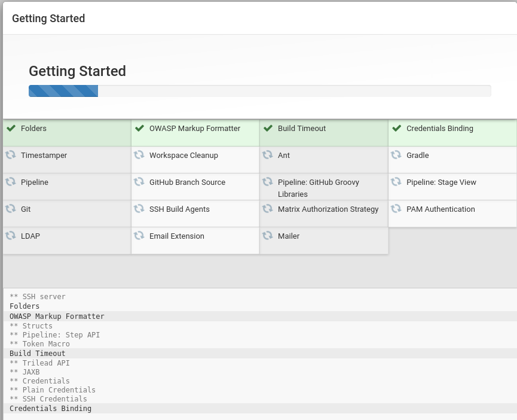
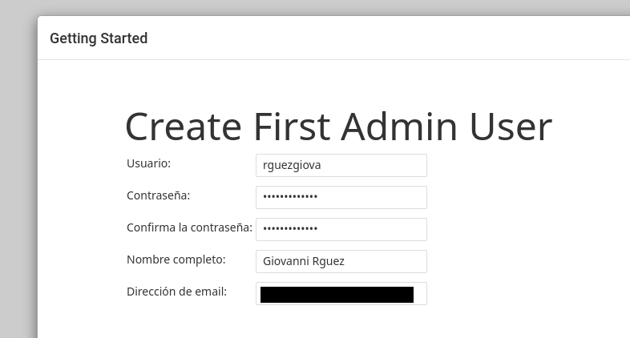
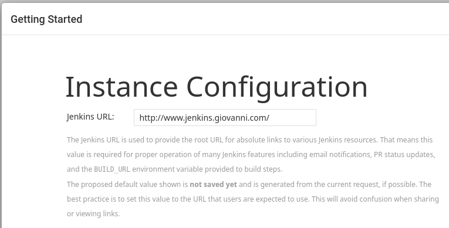
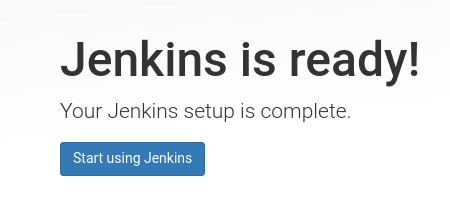

# **Instalación y Configuración de Jenkins en Docker**

## **Índice**
[Descarga de la imagen](#id1)<br>
[Ejecución del contenedor](#id2)<br>
[Configuración de Jenkins](#id3)<br>
[Fichero Dockerfile](#id4)<br>
[Fichero de Plugins](#id5)<br>
[Fichero docker-compose](#id6)<br>
[Test docker-compose](#id7)

## **Descarga de la imagen**<a name = "id1"></a>
Lo primero que haremos será ir a https://hub.docker.com/ y buscar la imagen de Jenkins.



Lo siguiente será descargar la imagen de Jenkins a través de la consola.

```bash
daw@budgie21:~/docker/jenkins$ docker pull jenkins/jenkins:lts
lts: Pulling from jenkins/jenkins
0e29546d541c: Pull complete 
11423c93b49c: Pull complete 
0a7e49db0973: Pull complete 
977259ae4ac6: Pull complete 
664d083fcd2d: Pull complete 
8a20d9bdf720: Pull complete 
cc94036a9149: Pull complete 
771e489c9ff6: Pull complete 
11d0bec8f08b: Pull complete 
ca11fa5d5337: Pull complete 
b465e025b587: Pull complete 
e0e171e8e73c: Pull complete 
969a814948b7: Pull complete 
1a83889b1424: Pull complete 
732f8876aa9d: Pull complete 
a36d15f157a4: Pull complete 
88bc217ad3f7: Pull complete 
Digest: sha256:983890f538ff42b2d153e0b5f45d97e750e80f08238ddb2bcf5c5dc4a606e77f
Status: Downloaded newer image for jenkins/jenkins:lts
docker.io/jenkins/jenkins:lts
```

Por último verificaremos si la imagen se descargó correctamente.

```bash
daw@budgie21:~/docker/jenkins$ docker images
REPOSITORY              TAG                   IMAGE ID       CREATED         SIZE
jenkins/jenkins         lts                   9aee0d53624f   6 days ago      441MB
```

## **Ejecución del contenedor**<a name = "id2"></a>
Ahora en este punto ejecutaremos el contenedor con la imagen de Jenkins.

```bash
daw@budgie21:~/docker/jenkins$ docker run -p 8080:8080 -p 50000:50000 -v /home/daw:/var/jenkins_home jenkins/jenkins:lts
Running from: /usr/share/jenkins/jenkins.war
webroot: EnvVars.masterEnvVars.get("JENKINS_HOME")
2022-01-18 16:55:07.670+0000 [id=1]	INFO	org.eclipse.jetty.util.log.Log#initialized: Logging initialized @445ms to org.eclipse.jetty.util.log.JavaUtilLog
2022-01-18 16:55:07.794+0000 [id=1]	INFO	winstone.Logger#logInternal: Beginning extraction from war file
2022-01-18 16:55:09.024+0000 [id=1]	WARNING	o.e.j.s.handler.ContextHandler#setContextPath: Empty contextPath
2022-01-18 16:55:09.077+0000 [id=1]	INFO	org.eclipse.jetty.server.Server#doStart: jetty-9.4.43.v20210629; built: 2021-06-30T11:07:22.254Z; git: 526006ecfa3af7f1a27ef3a288e2bef7ea9dd7e8; jvm 11.0.13+8
2022-01-18 16:55:09.273+0000 [id=1]	INFO	o.e.j.w.StandardDescriptorProcessor#visitServlet: NO JSP Support for /, did not find org.eclipse.jetty.jsp.JettyJspServlet
2022-01-18 16:55:09.308+0000 [id=1]	INFO	o.e.j.s.s.DefaultSessionIdManager#doStart: DefaultSessionIdManager workerName=node0
2022-01-18 16:55:09.308+0000 [id=1]	INFO	o.e.j.s.s.DefaultSessionIdManager#doStart: No SessionScavenger set, using defaults
2022-01-18 16:55:09.309+0000 [id=1]	INFO	o.e.j.server.session.HouseKeeper#startScavenging: node0 Scavenging every 600000ms
2022-01-18 16:55:09.649+0000 [id=1]	INFO	hudson.WebAppMain#contextInitialized: Jenkins home directory: /var/jenkins_home found at: EnvVars.masterEnvVars.get("JENKINS_HOME")
2022-01-18 16:55:09.907+0000 [id=1]	INFO	o.e.j.s.handler.ContextHandler#doStart: Started w.@216914{Jenkins v2.319.2,/,file:///var/jenkins_home/war/,AVAILABLE}{/var/jenkins_home/war}
2022-01-18 16:55:09.953+0000 [id=1]	INFO	o.e.j.server.AbstractConnector#doStart: Started ServerConnector@72cf2de5{HTTP/1.1, (http/1.1)}{0.0.0.0:8080}
2022-01-18 16:55:09.954+0000 [id=1]	INFO	org.eclipse.jetty.server.Server#doStart: Started @2732ms
2022-01-18 16:55:09.955+0000 [id=24]	INFO	winstone.Logger#logInternal: Winstone Servlet Engine running: controlPort=disabled
2022-01-18 16:55:11.263+0000 [id=31]	INFO	jenkins.InitReactorRunner$1#onAttained: Started initialization
2022-01-18 16:55:11.281+0000 [id=31]	INFO	jenkins.InitReactorRunner$1#onAttained: Listed all plugins
WARNING: An illegal reflective access operation has occurred
WARNING: Illegal reflective access by com.google.inject.internal.cglib.core.$ReflectUtils$2 (file:/var/jenkins_home/war/WEB-INF/lib/guice-4.0.jar) to method java.lang.ClassLoader.defineClass(java.lang.String,byte[],int,int,java.security.ProtectionDomain)
WARNING: Please consider reporting this to the maintainers of com.google.inject.internal.cglib.core.$ReflectUtils$2
WARNING: Use --illegal-access=warn to enable warnings of further illegal reflective access operations
WARNING: All illegal access operations will be denied in a future release
2022-01-18 16:55:12.275+0000 [id=32]	INFO	jenkins.InitReactorRunner$1#onAttained: Prepared all plugins
2022-01-18 16:55:12.279+0000 [id=32]	INFO	jenkins.InitReactorRunner$1#onAttained: Started all plugins
2022-01-18 16:55:12.296+0000 [id=34]	INFO	jenkins.InitReactorRunner$1#onAttained: Augmented all extensions
2022-01-18 16:55:15.774+0000 [id=34]	INFO	jenkins.InitReactorRunner$1#onAttained: System config loaded
2022-01-18 16:55:15.777+0000 [id=32]	INFO	jenkins.InitReactorRunner$1#onAttained: System config adapted
2022-01-18 16:55:15.778+0000 [id=32]	INFO	jenkins.InitReactorRunner$1#onAttained: Loaded all jobs
2022-01-18 16:55:15.778+0000 [id=32]	INFO	jenkins.InitReactorRunner$1#onAttained: Configuration for all jobs updated
2022-01-18 16:55:15.830+0000 [id=49]	INFO	hudson.model.AsyncPeriodicWork#lambda$doRun$1: Started Download metadata
2022-01-18 16:55:15.848+0000 [id=49]	INFO	hudson.util.Retrier#start: Attempt #1 to do the action check updates server
2022-01-18 16:55:19.043+0000 [id=36]	INFO	jenkins.install.SetupWizard#init: 

*************************************************************
*************************************************************
*************************************************************

Jenkins initial setup is required. An admin user has been created and a password generated.
Please use the following password to proceed to installation:

fd3ea5b5755c454f95ecf46a0834cb7f

This may also be found at: /var/jenkins_home/secrets/initialAdminPassword
```

## **Configuración de Jenkins**<a name = "id3"></a>
Ahora abrimos un navegador y vamos a www.jenkins.giovanni.com y si todo ha ido correctamente veremos lo siguiente.



Lo siguiente será elegir la opción de **Install suggested plugins**.



Después de esto, empezará la instalación de Jenkins.



Próximo a la instalación, creamos el usuario Administrador de Jenkins.



Instanciamos la dirección por la que accederemos.



Y ya veremos que Jenkins está listo para el uso.



## **Fichero Dockerfile**<a name = "id4"></a>
En este paso crearemos un fichero **Dockerfile** con lo siguiente:

```bash
FROM jenkins/jenkins

USER root
RUN apt-get -y update && apt-get install -y maven

USER jenkins
COPY plugins.txt /usr/share/jenkins/ref/plugins.txt
RUN /usr/local/bin/install-plugins.sh < /usr/share/jenkins/ref/plugins.txt
```

## **Fichero plugins.txt**<a name = "id5"></a>
A este añadimos el fichero **plugins.txt** donde añadiremos dentro todos los plugins que queremos que instale Jenkins.

```bash
ace-editor
analysis-core
ant
antisamy-markup-formatter
apache-httpcomponents-client-4-api
authentication-tokens
branch-api
build-monitor-plugin
build-pipeline-plugin
checkstyle
cloudbees-folder
conditional-buildstep
copyartifact  
credentials
credentials-binding
deploy
display-url-api
docker-commons
docker-workflow
durable-task
findbugs
git
github
github-api
git-client
git-server
gradle
greenballs
handlebars
jackson2-api
javadoc
jquery
jquery-detached
jsch
junit
mailer
matrix-project
maven-plugin
momentjs
nested-view
parameterized-trigger
pipeline-build-step
pipeline-graph-analysis
pipeline-input-step
pipeline-milestone-step
pipeline-model-api
pipeline-model-declarative-agent
pipeline-model-definition
pipeline-model-extensions
pipeline-rest-api
pipeline-stage-step
pipeline-stage-tags-metadata
pipeline-stage-view
plain-credentials
pmd
run-condition
scm-api
script-security  
ssh-credentials
structs
token-macro
workflow-aggregator
workflow-api
workflow-basic-steps
workflow-cps
workflow-cps-global-lib
workflow-durable-task-step
workflow-job
workflow-multibranch
workflow-scm-step
workflow-step-api
workflow-support
```

## **Fichero docker-compose.yml**<a name = "id6"></a>
Y el fichero **docker-compose.yml**.

```bash
version: '3'
services:
  master:
    build: jenkins
    image: dpl/jenkins:latest
    restart: unless-stopped
    hostname: jenkins
    ports:
      - "8080:8080"
      - "50000:50000"
    volumes:
      - jenkins_home:/var/jenkins_home

volumes:
  jenkins_home:
```

Esta será la estructura de fichero.

```bash
daw@budgie21:~/docker/jenkins$ tree
.
├── docker-compose.yml
├── jenkins
│   └── Dockerfile
└── plugins.txt
```

## **Test docker-compose**<a name = "id7"></a>
Ahora lanzaremos el docker-compose con lo siguiente:

```bash
daw@budgie21:~/docker/jenkins$ docker-compose build
Building master
Sending build context to Docker daemon  2.048kB
Step 1/6 : FROM jenkins/jenkins
 ---> b3febfc71dcd
Step 2/6 : USER root
 ---> Using cache
 ---> 9734a3ae2f03
Step 3/6 : RUN apt-get -y update && apt-get install -y maven
 ---> Running in b16bfd3bc65d
Get:1 http://deb.debian.org/debian bullseye InRelease [116 kB]
Get:2 http://security.debian.org/debian-security bullseye-security InRelease [44.1 kB]
Get:3 http://deb.debian.org/debian bullseye-updates InRelease [39.4 kB]
Get:4 http://security.debian.org/debian-security bullseye-security/main amd64 Packages [107 kB]
Get:5 http://deb.debian.org/debian bullseye/main amd64 Packages [8183 kB]
Get:6 http://deb.debian.org/debian bullseye-updates/main amd64 Packages [2592 B]
Fetched 8492 kB in 12s (700 kB/s)
```

Al finalizar lanzaremos **docker-compose up -d**.

```bash
daw@budgie21:~/docker/jenkins$ docker-compose up -d
Starting jenkins_master_1 ... done
```

Por último abrimos un navegador y escribimos **www.jenkins.giovanni.com:8080** y se verá lo siguiente:


Para conseguir la contraseña de desbloqueo escribimos lo siguiente:

```bash
daw@budgie21:~/docker/jenkins$ docker exec -it jenkins_master_1 cat /var/jenkins_home/secrets/initialAdminPassword
c33f55577a9e454d853b2294261cbf0e
```

Lo siguiente será elegir la opción de **Install suggested plugins**.


Después de esto, empezará la instalación de Jenkins.


Próximo a la instalación, creamos el usuario Administrador de Jenkins.


Instanciamos la dirección por la que accederemos.


Y ya veremos que Jenkins está listo para el uso.

