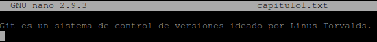

# **Ejemplos en Git**

## **Indice**
[Introducción](#id1)<br>
[Ejercicio 1](#id2)<br>
[Ejercicio 2](#id3)<br>
[Ejercicio 3](#id4)<br>
[Ejercicio 4](#id5)<br>
[Ejercicio 5](#id6)<br>
[Ejercicio 6](#id7)<br>
[Ejercicio 7](#id8)<br>
[Ejercicio 8](#id9)<br>
[Ejercicio 9](#id10)

### **Introducción**<a name = "id1"></a>
Antes de empezar los ejercicios clonaremos el repositorio remoto: https://github.com/jpexposito/libro utilizando el siguiente comando y nos moveremos dentro de él.

```
daw@DLP17-Lubuntu18:~$ git clone https://github.com/jpexposito/libro.git
Clonando en 'libro'...
remote: Enumerating objects: 3, done.
remote: Counting objects: 100% (3/3), done.
remote: Compressing objects: 100% (2/2), done.
remote: Total 3 (delta 0), reused 0 (delta 0), pack-reused 0
Recibiendo objetos: 100% (3/3), listo.
daw@DLP17-Lubuntu18:~$ cd libro/
```

### **Ejercicio 1**<a name = "id2"></a>
En el primer ejercicio, lo primero que todo será mostrar el historial de cambios en el repositorio, usaremos el siguiente comando:

```
daw@DLP17-Lubuntu18:~$ git clone https://github.com/jpexposito/libro.git
Clonando en 'libro'...
remote: Enumerating objects: 3, done.
remote: Counting objects: 100% (3/3), done.
remote: Compressing objects: 100% (2/2), done.
remote: Total 3 (delta 0), reused 0 (delta 0), pack-reused 0
Recibiendo objetos: 100% (3/3), listo.
daw@DLP17-Lubuntu18:~$ cd libro/
```

El siguiente paso será crear el directorio capítulos y dentro de él, crear el fichero **capitulo1.txt** con el texto "Git es un sistema de control de versiones ideado por Linus Torvalds.".

```
daw@DLP17-Lubuntu18:~/libro$ nano capitulo1.txt
```



Ahora añadiremos los cambios a la zona de intercambio temporal.

```
daw@DLP17-Lubuntu18:~/libro$ git add .
```

Añadiremos el commit de los cambios realizados con  el menasje "Añadido capitulo 1".

```
daw@DLP17-Lubuntu18:~/libro$ git commit -m "Añadido capitulo 1"
[main ebd9409] Añadido capitulo 1
 1 file changed, 2 insertions(+)
 create mode 100644 capitulo1.txt
```

Por último volveremos a mostrar el historial de cambios del repositorio.

```
daw@DLP17-Lubuntu18:~/libro$ git log
commit ebd94092a5fabc7b485d6175d58ed3ec573608bc (HEAD -> main)
Author: rguezgiova <grodriguez.inf@gmail.com>
Date:   Mon Sep 27 18:16:38 2021 +0100

    Añadido capitulo 1

commit 4dcb74b18a32f24061bc2e7c415f09f7aaff4971 (origin/main, origin/HEAD)
Author: Joatham Pérez Expósito <jpe.gsc@gmail.com>
Date:   Mon Sep 27 11:57:59 2021 +0100

    Initial commit
```
### **Ejercicio 2**<a name = "id3"></a>
Lo primero que haremos será crear el fichero **capitulo2.txt** en el directorio con el texto: "El flujo de trabajo básico con Git consiste en: 1- Hacer cambios en el repositorio. 2- Añadir los cambios a la zona de intercambio temporal. 3- Hacer un commit de los cambios.".

```
daw@DLP17-Lubuntu18:~/libro$ nano capitulo2.txt
```


Ahora añadimos los cambios a la zona de intercambio temporal.

```
daw@DLP17-Lubuntu18:~/libro$ git add .
```

Haremos un commit de los cambios realizados con el mensaje "Añadido capitulo 2".

```
daw@DLP17-Lubuntu18:~/libro$ git commit -m "Añadido capitulo 2"
[main 40ad7b0] Añadido capitulo 2
 1 file changed, 5 insertions(+)
 create mode 100644 capitulo2.txt
```

Por último compararemos las diferencias entre la última versión y las anteriores.

```
daw@DLP17-Lubuntu18:~/libro$ git diff HEAD~2..HEAD
diff --git a/capitulo1.txt b/capitulo1.txt
new file mode 100644
index 0000000..071ec89
--- /dev/null
+++ b/capitulo1.txt
@@ -0,0 +1,2 @@
+Git es un sistema de control de versiones ideado por Linus Torvalds.
+
diff --git a/capitulo2.txt b/capitulo2.txt
new file mode 100644
index 0000000..c1e7bb2
--- /dev/null
+++ b/capitulo2.txt
@@ -0,0 +1,5 @@
+El flujo de trabajo básico con Git consiste en:
+1- Hacer cambios en el repositorio.
+2- Añadir los cambios a la zona de intercambio temporal.
+3- Hacer un commit de los cambios.
+
```

### **Ejercicio 3**<a name = "id4"></a>
Como en los anteriores ejercicios, lo primero que haremos será crear el fichero **capitulo3.txt** con lo siguiente "Git permite la creación de ramas lo que permite tener distintas versiones del mismo proyecto y trabajar de manera simultanea en ellas.".

```
daw@DLP17-Lubuntu18:~/libro$ nano capitulo3.txt
```


Lo siguiente es añadir los cambios a la zona de intercambio temporal.

```
daw@DLP17-Lubuntu18:~/libro$ git add .
```

Crearemos el commit de los cambios con el mensaje "Añadido capitulo 3".

```
daw@DLP17-Lubuntu18:~/libro$ git commit -m "Añadido capitulo 3"
[main 744e11f] Añadido capitulo 3
 1 file changed, 3 insertions(+)
 create mode 100644 capitulo3.txt
```

Por último mostraremos las diferencias entre la primera versión y la que acabamos de realizar.

```
daw@DLP17-Lubuntu18:~/libro$ git log
commit 744e11f744255ad8ef85d43e36dfad30f3dbca89 (HEAD -> main)
Author: rguezgiova <grodriguez.inf@gmail.com>
Date:   Mon Sep 27 18:32:43 2021 +0100

    Añadido capitulo 3

commit 40ad7b059155b32ae4833bf8c9c74ce1af66417d
Author: rguezgiova <grodriguez.inf@gmail.com>
Date:   Mon Sep 27 18:22:58 2021 +0100

    Añadido capitulo 2

commit ebd94092a5fabc7b485d6175d58ed3ec573608bc
Author: rguezgiova <grodriguez.inf@gmail.com>
Date:   Mon Sep 27 18:16:38 2021 +0100

    Añadido capitulo 1

commit 4dcb74b18a32f24061bc2e7c415f09f7aaff4971 (origin/main, origin/HEAD)
Author: Joatham Pérez Expósito <jpe.gsc@gmail.com>
Date:   Mon Sep 27 11:57:59 2021 +0100

    Initial commit
```

### **Ejercicio 4**<a name = "id5"></a>
Lo primero que haremos en este ejercicio será modificar el fichero **indice.txt** y añadirle lo siguiente: "Capítulo 5: Conceptos avanzados".

```
daw@DLP17-Lubuntu18:~/libro$ nano indice.txt
```


Lo próximo será añadir los cambios a la zona de intercambio temporal.

```
daw@DLP17-Lubuntu18:~/libro$ git add .
```

Añadimos el commit con el mensaje "Añadido capítulo 5 al índice.".

```
daw@DLP17-Lubuntu18:~/libro$ git commit -m "Añadido capitulo 5 al índice."
[main 53d8abb] Añadido capitulo 5 al índice.
 2 files changed, 21 insertions(+)
 create mode 100644 ..HEAD
 create mode 100644 indice.txt
```

Por último visualizaremos quién ha realizado los cambios sobre el fichero.

```
daw@DLP17-Lubuntu18:~/libro$ git annotate indice.txt
53d8abba        (rguezgiova     2021-09-28 09:48:48 +0100       1)Capítulo 5: Conceptos avanzados
```

### **Ejercicio 5**<a name = "id6"></a>
En este ejercicio crearemos una nueva rama en el repositorio, para ello haremos lo siguiente:

```
daw@DLP17-Lubuntu18:~/libro$ git branch bibliografia
```

Ahora visualizaremos la rama que acabamos de crear.

```
daw@DLP17-Lubuntu18:~/libro$ git branch -av
  bibliografia        53d8abb Añadido capitulo 5 al índice.
* main                53d8abb [adelante 4] Añadido capitulo 5 al índice.
  remotes/origin/HEAD -> origin/main
  remotes/origin/main 4dcb74b Initial commit
```

### **Ejercicio 6**<a name = "id7"></a>
Lo primero que haremos será crear el fichero **capitulo4.txt** con el texto "En este capítulo veremos cómo usar GitHub para alojar repositorios en remoto.".

```
daw@DLP17-Lubuntu18:~/libro$ nano capitulo4.txt
```


Añadiremos los cambios a la zona de intercambio temporal.

```
daw@DLP17-Lubuntu18:~/libro$ git add .
```

Realizamos el commit correspondiente con el mensaje "Añadido capítulo 4.".

```
daw@DLP17-Lubuntu18:~/libro$ git commit -m "Añadido capitulo 4."
[main acf126a] Añadido capitulo 4.
 1 file changed, 1 insertion(+)
 create mode 100644 capitulo4.txt
 ```

 Por último mostraremos todo el historial del repositorio con las ramas incluidas.

 ```
 daw@DLP17-Lubuntu18:~/libro$ git log --graph --all --oneline
* acf126a (HEAD -> main) Añadido capitulo 4.
* 53d8abb (bibliografia) Añadido capitulo 5 al índice.
* 744e11f Añadido capitulo 3
* 40ad7b0 Añadido capitulo 2
* ebd9409 Añadido capitulo 1
* 4dcb74b (origin/main, origin/HEAD) Initial commit
```

### **Ejercicio 7**<a name = "id8"></a>
En este ejercicio, lo primero que haremos será movernos a la rama **bibliografia**.

```
daw@DLP17-Lubuntu18:~/libro$ git checkout bibliografia
Cambiado a rama 'bibliografia'
```

Dentro ya de la rama, creamos el fichero **bibliografia.txt** con el texto "Chacon, S. and Straub, B. Pro Git. Apress.".

```
daw@DLP17-Lubuntu18:~/libro$ nano bibliografia.txt
```


Añadimos los cambios a la zona de intercambio temporal.

```
daw@DLP17-Lubuntu18:~/libro$ git add .
```

Realizamos el commit correspondiente con el mensaje "Añadida primera referencia bibliográfica.".

```
daw@DLP17-Lubuntu18:~/libro$ git commit -m "Añadida primera referencia bibliografica."
[bibliografia 985e0d1] Añadida primera referencia bibliografica.
 1 file changed, 2 insertions(+)
 create mode 100644 bibliografia.txt
```

Por último como en el ejercicio anterior, mostraremos el historial de todo el repositorio.

```
daw@DLP17-Lubuntu18:~/libro$ git log --graph --all --oneline
* 985e0d1 (HEAD -> bibliografia) Añadida primera referencia bibliografica.
| * acf126a (main) Añadido capitulo 4.
|/  
* 53d8abb Añadido capitulo 5 al índice.
* 744e11f Añadido capitulo 3
* 40ad7b0 Añadido capitulo 2
* ebd9409 Añadido capitulo 1
* 4dcb74b (origin/main, origin/HEAD) Initial commit
```

### **Ejercicio 8**<a name = "id9"></a>
En este ejercicio vamos a juntar la  rama **bibliografia** con la rama **master**.

```
daw@DLP17-Lubuntu18:~/libro$ git checkout main
Cambiado a rama 'main'
Tu rama está adelantada a 'origin/main' por 5 commits.
  (usa "git push" para publicar tus commits locales)
daw@DLP17-Lubuntu18:~/libro$ git merge bibliografia
Merge made by the 'recursive' strategy.
 bibliografia.txt | 2 ++
 1 file changed, 2 insertions(+)
 create mode 100644 bibliografia.txt
```

El siguiente paso será mostrar el historial del repositorio.

```
daw@DLP17-Lubuntu18:~/libro$ git log --graph --all --oneline
*   a563fdb (HEAD -> main) Merge branch 'bibliografia' into main fusion de la rama bibliografia con la rama master.
|\  
| * 985e0d1 (bibliografia) Añadida primera referencia bibliografica.
* | acf126a Añadido capitulo 4.
|/  
* 53d8abb Añadido capitulo 5 al índice.
* 744e11f Añadido capitulo 3
* 40ad7b0 Añadido capitulo 2
* ebd9409 Añadido capitulo 1
* 4dcb74b (origin/main, origin/HEAD) Initial commit
```

Eliminamos la rama **bibliografia**.

```
daw@DLP17-Lubuntu18:~/libro$ git branch -d bibliografia
Eliminada la rama bibliografia (era 985e0d1)..
```

Por último mostraremos de nuevo todo el historial del repositorio.

```
daw@DLP17-Lubuntu18:~/libro$ git log --graph --all --oneline
*   a563fdb (HEAD -> main) Merge branch 'bibliografia' into main fusion de la rama bibliografia con la rama master.
|\  
| * 985e0d1 Añadida primera referencia bibliografica.
* | acf126a Añadido capitulo 4.
|/  
* 53d8abb Añadido capitulo 5 al índice.
* 744e11f Añadido capitulo 3
* 40ad7b0 Añadido capitulo 2
* ebd9409 Añadido capitulo 1
* 4dcb74b (origin/main, origin/HEAD) Initial commit
```

### **Ejercicio 9**<a name = "id10"></a>
Lo primero que hacemos es crear la rama **bibliografia**.

```
daw@DLP17-Lubuntu18:~/libro$ git branch bibliografia
```

Nos movemos a dicha rama.

```
daw@DLP17-Lubuntu18:~/libro$ git checkout bibliografia
Cambiado a rama 'bibliografia'
```

Ahora editaremos el fichero **bibliografia.txt** y añadimos el texto "Scott Chacon and Ben Straub. Pro Git. Apress. Ryan Hodson. Ry’s Git Tutorial. Smashwords (2014)".

```
daw@DLP17-Lubuntu18:~/libro$ nano bibliografia.txt
```


El próximo paso será cambiar a la rama **master**.

```
daw@DLP17-Lubuntu18:~/libro$ git checkout main
M	bibliografia.txt
Cambiado a rama 'main'
Tu rama está adelantada a 'origin/main' por 7 commits.
  (usa "git push" para publicar tus commits locales)
```

Ahora editaremos el fichero **bibliografia.txt** de la rama master.

```
daw@DLP17-Lubuntu18:~/libro$ nano bibliografia.txt
```


Añadimos los cambios realizados a la zona de intercambio temporal.

```
daw@DLP17-Lubuntu18:~/libro$ git add .
```

Realizamos un commit con el mensaje "Añadida nueva referencia bibliográfica.".

```
daw@DLP17-Lubuntu18:~/libro$ git commit -m "Añadida nueva referencia bibliografica."
[main d22f951] Añadida nueva referencia bibliografica.
 1 file changed, 1 insertion(+)
```

Ahora fusionaremos la rama **bibliografia** con la rama **master**.

```
daw@DLP17-Lubuntu18:~/libro$ git merge bibliografia
Ya está actualizado.
```

Por último visualizaremos el historial del repositorio.

```
daw@DLP17-Lubuntu18:~/libro$ git log --graph --all --oneline
* d22f951 (HEAD -> main) Añadida nueva referencia bibliografica.
*   a563fdb (bibliografia) Merge branch 'bibliografia' into main fusion de la rama bibliografia con la rama master.
|\  
| * 985e0d1 Añadida primera referencia bibliografica.
* | acf126a Añadido capitulo 4.
|/  
* 53d8abb Añadido capitulo 5 al índice.
* 744e11f Añadido capitulo 3
* 40ad7b0 Añadido capitulo 2
* ebd9409 Añadido capitulo 1
* 4dcb74b (origin/main, origin/HEAD) Initial commit
```
