## **Instalación de Git**
### **Instalación con paquetes predeterminados**
En este paso instalaremos Git desde los repositorio de en la nube de Ubuntu, no necesitaremos nosotros descargarnos nada por nuestra cuenta.

Lo primero que haremos será abrir una terminal y lanzar en ella el comando **sudo apt update** para que nos actualice, si es necesario, todos los paquetes que tenemos en nuestro sistema.

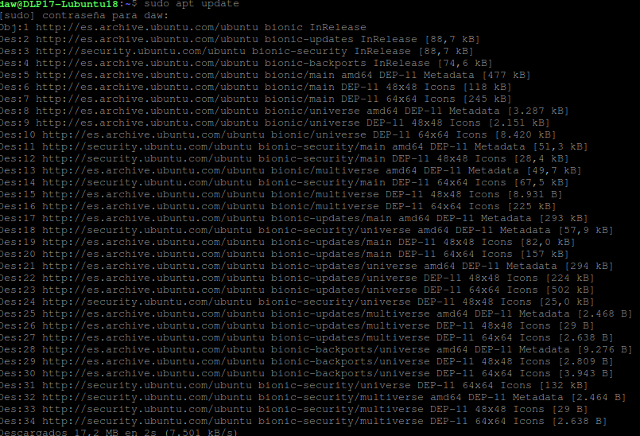

Lo siguiente será lanzar **sudo apt install git**, para instalar la versión de Git que esté en los repositorios en la nube, tendremos que aceptar la instalación escribiendo **S**.

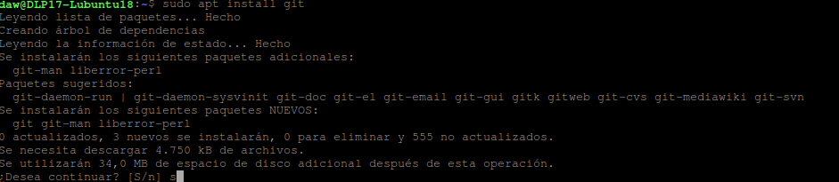

Ahora escribimos **git –version**, este nos mostrará por pantalla la versión instalada de Git.

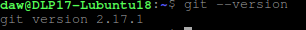

### **Instalación de Git desde la fuente**
En este paso, haremos lo contrario que en el anterior, descargaremos nosotros de la página de Git la versión que nosotros queramos de Git y no la que esté subida al repositorio en la nube por defecto de Ubuntu.

Lo primero que haremos, como en el paso anterior es actualizar los paquetes, para ello lanzamos el comando **sudo apt update**.

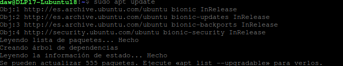

Lo siguiente que haremos es descargarnos el software necesario para el funcionamiento de Git, esto si que se encuentra en los repositorios por defecto, lanzaremos el comando **sudo apt install libz-dev libssl-dev libcurl4-gnutls-dev libexpat1-dev gettext cmake gcc** para instalaros todos y como anteriormente tendremos que escribir **S** para aceptar la instalación.

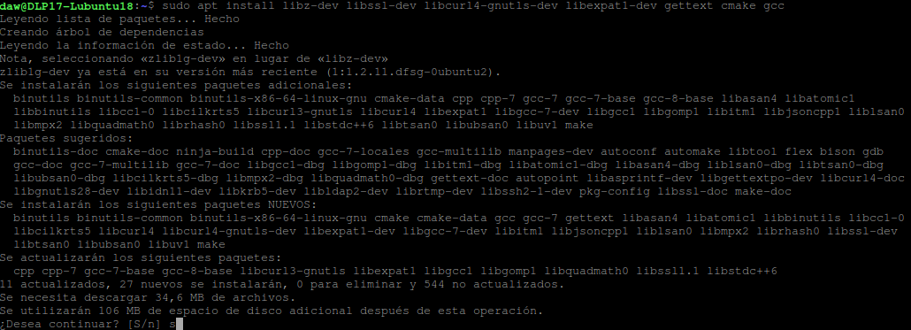

El siguiente paso será crear un directorio de archivos temporales y movernos a él, lo haremos lanzando lo siguiente:

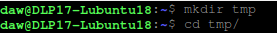

Ahora usaremos el comando **curl** para descargarnos la versión que queramos de git, le pondremos de nombre al fichero descargado **git.tar.gz**, para ello lanzaremos **curl -o git.tar.gz https://mirrors.edge.kernel.org/pub/software/scm/git/git-2.29.3.tar.gz**.

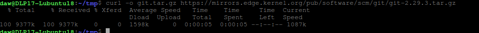

Descomprimiremos el fichero con el comando **tar -zxf git.tar.gz**, nos moveremos a él y crearemos el paquete lanzando **make prefix=/usr/local all**.

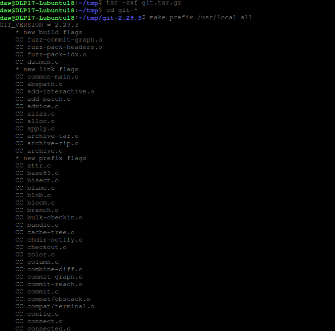

Cuando este largo proceso acabe instalaremos el paquete que acabamos de crear lanzando **sudo make prefix=/usr/local install**.

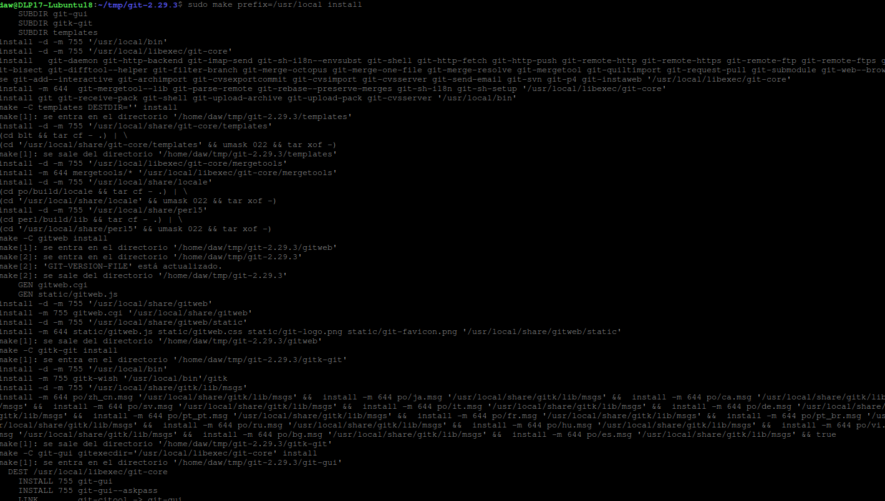

Ahora escribimos **git –version**, si todo lo anteriormente realizado está bien hecho, nos mostrará la versión de Git.

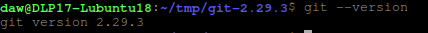

## **Configuración de Git**
Luego de la instalación de Git hay que hacer varios pasos para que podamos hacer uso de este en nuestro equipo.

El primer paso será lanzar el comando **git config --global user.name "Nombre de usuario"**, donde entre las comillas tendremos que escribir nuestro nombre de usuario de GitHub y **git config --global user.email "Email del usuario"** donde entre comillas tendrás que escribir tu email utilizado en la cuenta de GitHub.

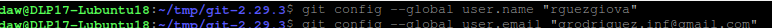

También podemos ver todos los elementos de configuración creados usando el comando **git config –list**.

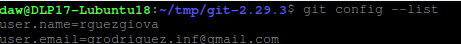

Toda información que se ingresa lo hace en un archivo de configuración de Git, se podrá modificarlo manualmente utilizando el comando **nano ~/.gitconfig**.

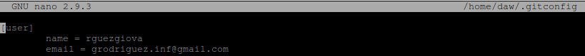
