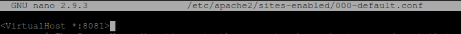
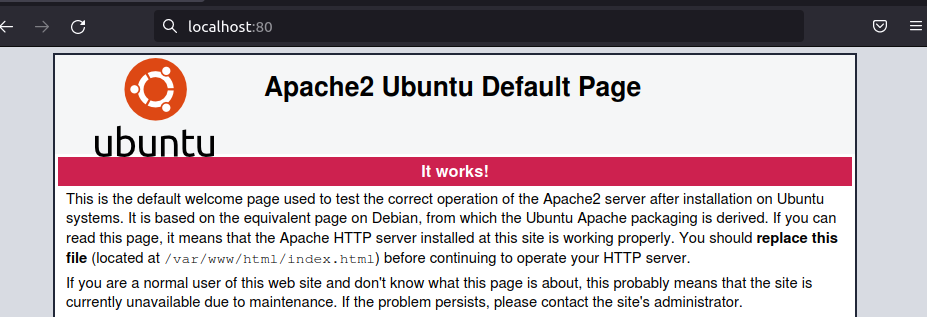

# **Instalación de Apache en Linux**

## **Índice**
[Actualización de repositorios](#id1)<br>
[Instalación de Apache](#id2)<br>
[Acceso](#id3)

### **Actualización de repositorios**<a name = "id1"></a>
Lo primero que haremos será actualizar los repositorios del sistema operativo.

```bash
daw@DLP17-Lubuntu18:~$  sudo apt update && sudo apt upgrade
Obj:2 http://security.ubuntu.com/ubuntu bionic-security InRelease                                       
Obj:3 http://es.archive.ubuntu.com/ubuntu bionic InRelease                              
Obj:1 https://packages.gitlab.com/gitlab/gitlab-ce/ubuntu bionic InRelease              
Obj:4 http://es.archive.ubuntu.com/ubuntu bionic-updates InRelease              
Obj:5 http://es.archive.ubuntu.com/ubuntu bionic-backports InRelease
```

### **Instalación de Apache**<a name = "id2"></a>
Ahora instalaremos Apache2 haciendo lo siguiente:

```bash
daw@DLP17-Lubuntu18:~$   sudo apt install apache2
Leyendo lista de paquetes... Hecho
Creando árbol de dependencias       
Leyendo la información de estado... Hecho
El paquete indicado a continuación se instaló de forma automática y ya no es necesario.
  libllvm6.0
Utilice «sudo apt autoremove» para eliminarlo.
Se instalarán los siguientes paquetes adicionales:
  apache2-bin apache2-data apache2-utils libapr1 libaprutil1 libaprutil1-dbd-sqlite3 libaprutil1-ldap
Paquetes sugeridos:
  apache2-doc apache2-suexec-pristine | apache2-suexec-custom
Se instalarán los siguientes paquetes NUEVOS:
  apache2 apache2-bin apache2-data apache2-utils libapr1 libaprutil1 libaprutil1-dbd-sqlite3
  libaprutil1-ldap
0 actualizados, 8 nuevos se instalarán, 0 para eliminar y 0 no actualizados.
Se necesita descargar 1.605 kB de archivos.
Se utilizarán 6.505 kB de espacio de disco adicional después de esta operación.
```

Cambiaremos el puerto del 80 al 8081.



Reiniciaremos el proceso de **Apache** para que cargue la configuración nueva.

```bash
daw@DLP17-Lubuntu18:~$ sudo systemctl restart apache2
```

Ahora modificaremos la configuración del Firewall, haremos lo siguiente:

```bash
daw@DLP17-Lubuntu18:~$   sudo ufw app list
Aplicaciones disponibles:
  Apache
  Apache Full
  Apache Secure
  CUPS
  OpenSSH
```

Usaremos el perfil **Apache**, haremos lo siguiente:

```bash
daw@DLP17-Lubuntu18:~$ sudo ufw allow 'Apache'
Reglas actualizadas
Reglas actualizadas (v6)
```

Ahora verificamos el perfil:

```bash
daw@DLP17-Lubuntu18:~$   sudo ufw status
Estado: activo

Hasta                      Acción      Desde
-----                      ------      -----
Apache                     ALLOW       Anywhere                  
Apache (v6)                ALLOW       Anywhere (v6)   
```

También verificaremos el estado de **Apache**.

```bash
daw@DLP17-Lubuntu18:~$ sudo systemctl status apache2
● apache2.service - The Apache HTTP Server
   Loaded: loaded (/lib/systemd/system/apache2.service; enabled; vendor preset: enabled)
  Drop-In: /lib/systemd/system/apache2.service.d
           └─apache2-systemd.conf
   Active: active (running) since Tue 2021-10-05 16:50:27 WEST; 1min 33s ago
  Process: 5825 ExecStop=/usr/sbin/apachectl stop (code=exited, status=0/SUCCESS)
  Process: 5830 ExecStart=/usr/sbin/apachectl start (code=exited, status=0/SUCCESS)
 Main PID: 5834 (apache2)
    Tasks: 55 (limit: 4675)
   CGroup: /system.slice/apache2.service
           ├─5834 /usr/sbin/apache2 -k start
           ├─5835 /usr/sbin/apache2 -k start
           └─5836 /usr/sbin/apache2 -k start
```

### **Acceso**<a name = "id3"></a>
Por último abrimos un navegador y pondremos la IP: **localhost:80**.


