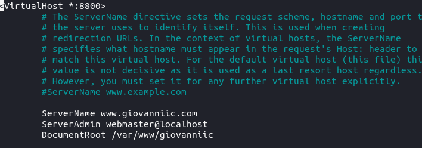
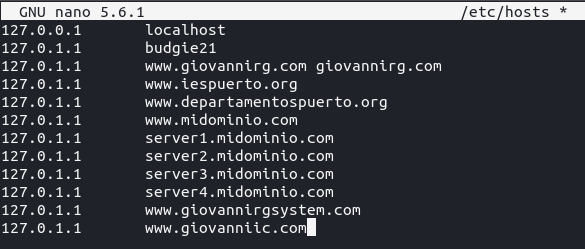
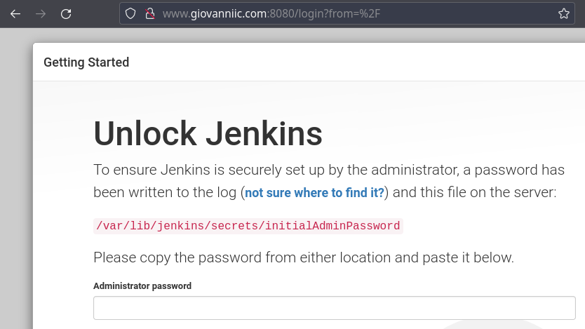
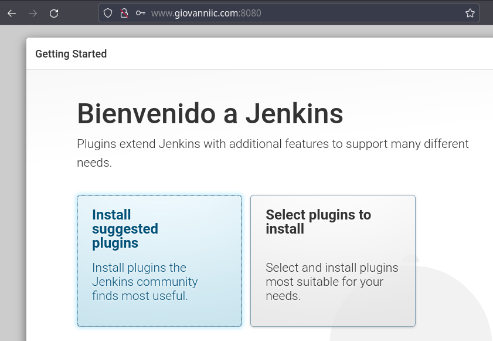
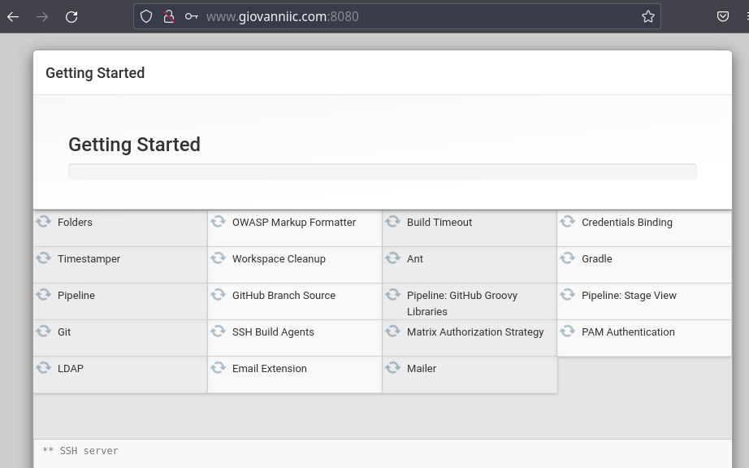
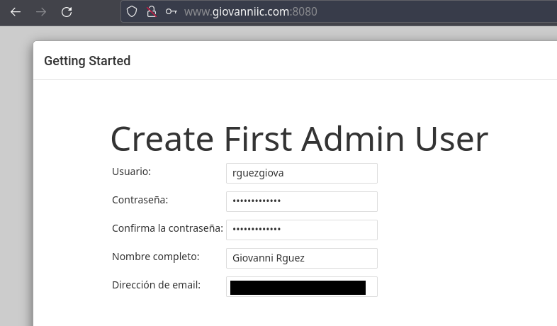
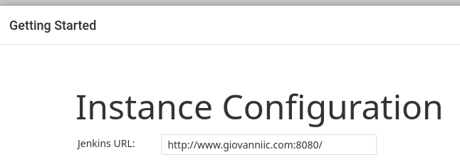
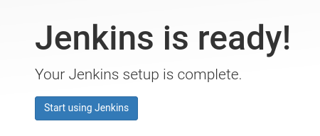

# **Instalación y Configuración de Jenkins en Linux**

## **Índice**
[Instalación de Jenkins](#id1)<br>
[Iniciar Jenkins](#id2)<br>
[Configuración del Firewall](#id3)<br>
[Creación del dominio](#id4)<br>
[Configuración de Jenkins](#id5)

## **Instalación de Jenkins**<a name = "id1"></a>
Lo primero que haremos será añadir la clave del repositorio de Jenkins al sistema.

```bash
daw@budgie21:~$ wget -q -O - https://pkg.jenkins.io/debian-stable/jenkins.io.key | sudo apt-key add
Warning: apt-key is deprecated. Manage keyring files in trusted.gpg.d instead (see apt-key(8)).
OK
```

Lo siguiente será agregar el repositorio a la lista de paquetes de nuestro sistema.

```bash
daw@budgie21:~$ sudo sh -c 'echo deb http://pkg.jenkins.io/debian-stable binary/ > /etc/apt/sources.list.d/jenkins.list'
```

Ahora lanzaremos una actualización de los paquetes que ya tenemos.

```bash
daw@budgie21:~$ sudo apt update
Obj:1 http://es.archive.ubuntu.com/ubuntu impish InRelease
Des:2 http://es.archive.ubuntu.com/ubuntu impish-updates InRelease [110 kB]                              
Obj:4 https://download.docker.com/linux/ubuntu focal InRelease                                           
Des:5 http://security.ubuntu.com/ubuntu impish-security InRelease [110 kB]                               
Des:6 http://es.archive.ubuntu.com/ubuntu impish-backports InRelease [101 kB]                            
Ign:3 https://pkg.jenkins.io/debian-stable binary/ InRelease                                             
Des:7 http://es.archive.ubuntu.com/ubuntu impish-updates/main amd64 Packages [219 kB]  
Des:9 http://es.archive.ubuntu.com/ubuntu impish-updates/main i386 Packages [104 kB]                     
Des:8 https://pkg.jenkins.io/debian-stable binary/ Release [2.044 B]                                     
Des:10 http://es.archive.ubuntu.com/ubuntu impish-updates/main Translation-en [58,5 kB]                  
Des:11 http://es.archive.ubuntu.com/ubuntu impish-updates/main amd64 DEP-11 Metadata [21,5 kB]           
Des:12 http://es.archive.ubuntu.com/ubuntu impish-updates/main DEP-11 48x48 Icons [20,9 kB]              
Des:13 http://es.archive.ubuntu.com/ubuntu impish-updates/main DEP-11 64x64 Icons [34,6 kB]              
Des:14 http://es.archive.ubuntu.com/ubuntu impish-updates/main amd64 c-n-f Metadata [3.960 B]            
Des:15 http://es.archive.ubuntu.com/ubuntu impish-updates/universe i386 Packages [51,7 kB]               
Des:16 http://es.archive.ubuntu.com/ubuntu impish-updates/universe amd64 Packages [84,2 kB]              
Des:17 https://pkg.jenkins.io/debian-stable binary/ Release.gpg [833 B]                                  
Des:18 http://es.archive.ubuntu.com/ubuntu impish-updates/universe Translation-en [33,1 kB]              
Des:19 http://es.archive.ubuntu.com/ubuntu impish-updates/universe amd64 DEP-11 Metadata [4.488 B]
Des:20 http://es.archive.ubuntu.com/ubuntu impish-updates/universe amd64 c-n-f Metadata [3.292 B]
Des:21 http://es.archive.ubuntu.com/ubuntu impish-backports/universe amd64 DEP-11 Metadata [9.088 B]
Des:22 http://security.ubuntu.com/ubuntu impish-security/main i386 Packages [54,3 kB]         
Des:23 https://pkg.jenkins.io/debian-stable binary/ Packages [21,2 kB]                  
Obj:24 https://deb.nodesource.com/node_16.x impish InRelease                                   
Des:25 http://security.ubuntu.com/ubuntu impish-security/main amd64 Packages [148 kB]
Des:26 http://security.ubuntu.com/ubuntu impish-security/main Translation-en [39,1 kB]
Des:27 http://security.ubuntu.com/ubuntu impish-security/main amd64 DEP-11 Metadata [9.176 B]
Des:28 http://security.ubuntu.com/ubuntu impish-security/main DEP-11 48x48 Icons [7.779 B]
Des:29 http://security.ubuntu.com/ubuntu impish-security/main DEP-11 64x64 Icons [14,3 kB]
Des:30 http://security.ubuntu.com/ubuntu impish-security/main amd64 c-n-f Metadata [2.452 B]
Des:31 http://security.ubuntu.com/ubuntu impish-security/universe amd64 Packages [51,4 kB]
Des:32 http://security.ubuntu.com/ubuntu impish-security/universe i386 Packages [38,2 kB]
Des:33 http://security.ubuntu.com/ubuntu impish-security/universe Translation-en [21,4 kB]
Des:34 http://security.ubuntu.com/ubuntu impish-security/universe amd64 DEP-11 Metadata [2.312 B]
Des:35 http://security.ubuntu.com/ubuntu impish-security/universe amd64 c-n-f Metadata [2.464 B]
Descargados 1.385 kB en 2s (911 kB/s)                
```

Por último instalamos Jenkins.

```bash
daw@budgie21:~$ sudo apt install jenkins
Leyendo lista de paquetes... Hecho
Creando árbol de dependencias... Hecho
Leyendo la información de estado... Hecho
Se instalarán los siguientes paquetes adicionales:
  daemon net-tools
Se instalarán los siguientes paquetes NUEVOS:
  daemon jenkins net-tools
0 actualizados, 3 nuevos se instalarán, 0 para eliminar y 18 no actualizados.
Se necesita descargar 72,1 MB de archivos.
Se utilizarán 73,4 MB de espacio de disco adicional después de esta operación.
¿Desea continuar? [S/n] s
```

## **Iniciar Jenkins**<a name = "id2"></a>
El primer paso en este punto será inicializar Jenkins.

```bash
daw@budgie21:~$ sudo systemctl start jenkins
```

Y verificaremos si se ha iniciado correctamente.

```bash
daw@budgie21:~$ sudo systemctl status jenkins
● jenkins.service - LSB: Start Jenkins at boot time
     Loaded: loaded (/etc/init.d/jenkins; generated)
     Active: active (exited) since Mon 2022-01-17 16:46:21 WET; 3min 9s ago
       Docs: man:systemd-sysv-generator(8)
    Process: 14908 ExecStart=/etc/init.d/jenkins start (code=exited, status=0/SUCCESS)
        CPU: 262ms

ene 17 16:46:11 budgie21 systemd[1]: Starting LSB: Start Jenkins at boot time...
ene 17 16:46:18 budgie21 jenkins[14908]: Correct java version found
ene 17 16:46:18 budgie21 jenkins[14908]:  * Starting Jenkins Automation Server jenkins
ene 17 16:46:18 budgie21 su[14948]: (to jenkins) root on none
ene 17 16:46:18 budgie21 su[14948]: pam_unix(su-l:session): session opened for user jenkins by (uid=0)
ene 17 16:46:21 budgie21 jenkins[14908]:    ...done.
ene 17 16:46:21 budgie21 systemd[1]: Started LSB: Start Jenkins at boot time.
```

## **Configuración del Firewall**<a name = "id3"></a>
Ahora habilitaremos el puerto 8080.

```bash
sudo ufw allow 8080
Reglas actualizadas
Reglas actualizadas (v6)
```

Y comprobaremos si se permite el tráfico por dicho puerto.

```bash
daw@budgie21:~$ sudo ufw status
Estado: activo

Hasta                      Acción      Desde
-----                      ------      -----
Nginx HTTP                 ALLOW       Anywhere                  
21/tcp                     ALLOW       Anywhere                  
20/tcp                     ALLOW       Anywhere                  
30000:30050/tcp            ALLOW       Anywhere                  
8080                       ALLOW       Anywhere                  
Nginx HTTP (v6)            ALLOW       Anywhere (v6)             
21/tcp (v6)                ALLOW       Anywhere (v6)             
20/tcp (v6)                ALLOW       Anywhere (v6)             
30000:30050/tcp (v6)       ALLOW       Anywhere (v6)             
8080 (v6)                  ALLOW       Anywhere (v6)
```

## **Creación del dominio**<a name = "id4"></a>
Llegado a este punto, procederemos a la creación del dominio, para ello crearemos un nuevo fichero.



Añadimos el dominio a **/etc/hosts**.



Activamos el dominio y reiniciamos Apache para que entre en funcionamiento.

```bash
daw@budgie21:~$ sudo a2ensite giovanniic.conf 
Enabling site giovanniic.
To activate the new configuration, you need to run:
  systemctl reload apache2
daw@budgie21:~$ sudo systemctl reload apache2
```

## **Configuración de Jenkins**<a name = "id5"></a>
Para probar el funcionamiento y empezar la configuración de Jenkins abriremos un navegador y lanzaremos **giovanniic.com:8080**.



Ahora tendremos que buscar la contraseña

```bash
daw@budgie21:~$ sudo cat /var/lib/jenkins/secrets/initialAdminPassword
4b9c4c66c95d4bc198a2098a8450f059
```

Elegiremos la opción de **Install suggested plugins**.



Y empezará la instalación



Ahora crearemos el usuario Administrador de Jenkins.



Por último seleccionamos la configuración de instancia.



Veremos que Jenkins ya está listo.

