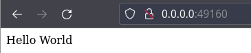

# **Desplegar una aplicación en Node.js** 

## **Índice**
[Instalación Node.js y NPM](#id1)<br>
[Creación App Node.js](#id1)<br>
[Creación Dockerfile](#id3)<br>
[Creación de la imagen](#id4)<br>
[Arrancar imagen](#id5)<br>
[Verificación](#id6)


## **Instalación Node.js y NPM**<a name = "id1"></a>
Lo primero que haremos será instalar **Node.js**, para ello lanzamos lo siguiente:

```bash
daw@DLP17-Lubuntu18:~/Desktop/node$ sudo apt install nodejs
Leyendo lista de paquetes... Hecho
Creando árbol de dependencias       
Leyendo la información de estado... Hecho
El paquete indicado a continuación se instaló de forma automática y ya no es necesario.
  libllvm6.0
Utilice «sudo apt autoremove» para eliminarlo.
Se instalarán los siguientes paquetes adicionales:
  libc-ares2 libhttp-parser2.7.1 nodejs-doc
Se instalarán los siguientes paquetes NUEVOS:
  libc-ares2 libhttp-parser2.7.1 nodejs nodejs-doc
0 actualizados, 4 nuevos se instalarán, 0 para eliminar y 14 no actualizados.
Se necesita descargar 5.606 kB de archivos.
Se utilizarán 24,7 MB de espacio de disco adicional después de esta operación.
¿Desea continuar? [S/n] s
```

Luego instalaremos **NPM**.

```bash
daw@DLP17-Lubuntu18:~/Desktop/node$ sudo apt install npm
Leyendo lista de paquetes... Hecho
Creando árbol de dependencias       
Leyendo la información de estado... Hecho
El paquete indicado a continuación se instaló de forma automática y ya no es necesario.
  libllvm6.0
Utilice «sudo apt autoremove» para eliminarlo.
Se instalarán los siguientes paquetes NUEVOS:
  npm
```

## **Creación App Node.js**<a name = "id2"></a>
Ahora crearemos la app de **Node.js**, para ello creamos el fichero **package.json** con lo siguiente:

```bash
{
    "name": "docker_web_app",
    "version": "1.0.0",
    "description": "Node.js on Docker",
    "author": "First Last <first.last@example.com>",
    "main": "server.js",
    "scripts": {
      "start": "node server.js"
    },
    "dependencies": {
      "express": "^4.16.1"
    }
}
```

Lanzamos el comando **npm install**.

```bash
daw@DLP17-Lubuntu18:~/Desktop/node$ npm install

added 50 packages, and audited 51 packages in 3s

found 0 vulnerabilities
npm notice 
npm notice New patch version of npm available! 8.1.0 -> 8.1.3
npm notice Changelog: https://github.com/npm/cli/releases/tag/v8.1.3
npm notice Run npm install -g npm@8.1.3 to update!
npm notice 
```

Lo siguiente será crear el fichero **server.js**.

```bash
'use strict';

const express = require('express');

// Constants
const PORT = 8080;
const HOST = '0.0.0.0';

// App
const app = express();
app.get('/', (req, res) => {
  res.send('Hello World');
});

app.listen(PORT, HOST);
console.log(`Running on http://${HOST}:${PORT}`);
```

## **Creación del fichero Dockerfile**<a name = "id3"></a>
Creamos el fichero **Dockerfile**.

```bash
FROM node:10

# Create app directory
WORKDIR /usr/src/app

# Install app dependencies
# A wildcard is used to ensure both package.json AND package-lock.json are copied
# where available (npm@5+)
COPY package*.json ./

RUN npm install
# If you are building your code for production
# RUN npm ci --only=production

# Bundle app source
COPY . .

EXPOSE 8080
CMD [ "node", "server.js" ]
```

Creamos también el fichero **.dockerignore**.

```bash
node_modules
npm-debug.log
```

## **Creación de la imagen**<a name = "id4"></a>
Ahora creamos la imagen que usaremos, haremos lo siguiente:

```bash
daw@DLP17-Lubuntu18:~/Desktop/node$ docker build . -t daw/node-web-app
Sending build context to Docker daemon   42.5kB
Step 1/7 : FROM node:10
10: Pulling from library/node
76b8ef87096f: Pull complete 
2e2bafe8a0f4: Pull complete 
b53ce1fd2746: Pull complete 
84a8c1bd5887: Pull complete 
7a803dc0b40f: Pull complete 
b800e94e7303: Pull complete 
0da9fbf60d48: Pull complete 
04dccde934cf: Pull complete 
73269890f6fd: Pull complete 
```

## **Arrancar imagen**<a name = "id5"></a>
Lanzaremos el comando **docker images** para comprobar si se ha creado correctamente nuestra imagen.

```bash
daw@DLP17-Lubuntu18:~/Desktop/node$ docker images
REPOSITORY              TAG                   IMAGE ID       CREATED             SIZE
daw/node-web-app        latest                273b237948dd   35 seconds ago      913MB
```

Arrancamos la imagen.

```bash
daw@DLP17-Lubuntu18:~/Desktop/node$ docker run -p 49160:8080 -d daw/node-web-app
173dd259b39f3e5ab13181a6bb7dd2b332924cb1d0295523683c43ecbbf9bed8
```

Ahora necesitamos saber el ID de nuestro contenedor.

```bash
daw@budgie21:~/Escritorio/node$ docker ps
CONTAINER ID   IMAGE              COMMAND                  CREATED          STATUS         PORTS                                         NAMES
5cd91cbe5b48   daw/node-web-app   "docker-entrypoint.s…"   10 seconds ago   Up 8 seconds   0.0.0.0:49160->8080/tcp, :::49160->8080/tcp   upbeat_neumann
```

Comprobamos el fichero log de nuestro contenedor.

```bash
daw@budgie21:~/Escritorio/node$ docker logs 5cd91cbe5b48
Running on http://0.0.0.0:8080
```

## **Verificación**<a name = "id6"></a>
Para verificar que nuestra app está en funcionamiento, comprobaremos el puerto por el que está ejecutandose.

```bash
0.0.0.0:49160->8080/tcp
```

Por último abrimos un navegador, vamos a la ip **0.0.0.0:49160**, si todo está correcto, veremos lo siguiente.

