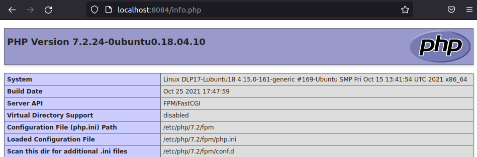

# ** Instalación de PHP en Linux**

## **Índice**
[PHP para Apache](#id1)<br>
[PHP para Ngnix](#id2)<br>
[Cómo probar PHP](#id3)

## **PHP para Apache**<a name = "id1"></a>
Lo primero que haremos será actualizar los paquetes.

```bash
daw@DLP17-Lubuntu18:~$ sudo apt update
[sudo] contraseña para daw: 
Obj:1 http://es.archive.ubuntu.com/ubuntu bionic InRelease
Obj:2 http://es.archive.ubuntu.com/ubuntu bionic-updates InRelease                                                  
Obj:4 http://security.ubuntu.com/ubuntu bionic-security InRelease                                                   
Obj:5 http://es.archive.ubuntu.com/ubuntu bionic-backports InRelease                                                
Obj:6 http://packages.microsoft.com/repos/code stable InRelease                                                     
Obj:3 https://packages.gitlab.com/gitlab/gitlab-ce/ubuntu bionic InRelease
Leyendo lista de paquetes... Hecho
Creando árbol de dependencias       
Leyendo la información de estado... Hecho
Se pueden actualizar 12 paquetes. Ejecute «apt list --upgradable» para verlos
```

Ahora instalaremos **PHP**.

```bash
daw@DLP17-Lubuntu18:~$ sudo apt install php
Leyendo lista de paquetes... Hecho
Creando árbol de dependencias       
Leyendo la información de estado... Hecho
El paquete indicado a continuación se instaló de forma automática y ya no es necesario.
  libllvm6.0
Utilice «sudo apt autoremove» para eliminarlo.
Se instalarán los siguientes paquetes adicionales:
  libapache2-mod-php7.2 php-common php7.2 php7.2-cli php7.2-common php7.2-json php7.2-opcache php7.2-readline
Paquetes sugeridos:
  php-pear
Se instalarán los siguientes paquetes NUEVOS:
  libapache2-mod-php7.2 php php-common php7.2 php7.2-cli php7.2-common php7.2-json php7.2-opcache php7.2-readline
0 actualizados, 9 nuevos se instalarán, 0 para eliminar y 12 no actualizados.
Se necesita descargar 3.871 kB de archivos.
Se utilizarán 17,2 MB de espacio de disco adicional después de esta operación.
¿Desea continuar? [S/n] s
```

## **PHP para Nginx**<a name = "id2"></a>
Ahora instalaremos **PHP** para **Nginx**.

```bash
daw@DLP17-Lubuntu18:~$ sudo apt install php-fpm
Leyendo lista de paquetes... Hecho
Creando árbol de dependencias       
Leyendo la información de estado... Hecho
El paquete indicado a continuación se instaló de forma automática y ya no es necesario.
  libllvm6.0
Utilice «sudo apt autoremove» para eliminarlo.
Se instalarán los siguientes paquetes adicionales:
  php7.2-fpm
Paquetes sugeridos:
  php-pear
Se instalarán los siguientes paquetes NUEVOS:
  php-fpm php7.2-fpm
0 actualizados, 2 nuevos se instalarán, 0 para eliminar y 12 no actualizados.
Se necesita descargar 1.417 kB de archivos.
Se utilizarán 4.990 kB de espacio de disco adicional después de esta operación.
¿Desea continuar? [S/n] s
```

Ahora tendremos que configurar **Nginx** para que se conecte con el servicio de **PHP**.

```bash
daw@DLP17-Lubuntu18:~$ sudo nano /etc/nginx/sites-available/default 
```

Y añadiremos lo siguiente:

```bash
location ~ \.php$ {
    include snippets fastcgi-php.conf;

    fastcgi_pass unix: var/run/php/php7.2-fpm.sock;
```

Recargaremos el servicio de **Nginx**.

```bash
daw@DLP17-Lubuntu18:~$ sudo systemctl reload nginx
```

## **Cómo probar PHP**<a name = "id3"></a>
Por último vamos a probar el servicio **PHP**, para ello vamos a crear un fichero.

```bash
daw@DLP17-Lubuntu18:~$ sudo nano /var/www/html/info.php
```

Con el siguiente contenido.

```bash
<?php
    phpinfo();
?>
```

Por último abriremos un navegador escribiendo la ip **http://localhost:8084/info.php**, y si todo está correcto se vería lo siguiente:

