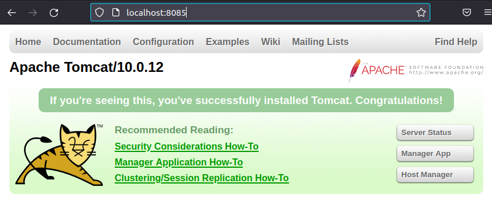

# **Instalación de Apache-Tomcat en Linux**

## **Índice**
[Actualización de repositorios](#id1)<br>

## **Actualización de repositorios**<a name = "id1"></a>
Lo primero que haremos será actualizar los repositorios del sistema operativo.

```bash
daw@DLP17-Lubuntu18:~$   sudo apt update && sudo apt upgrade
Obj:1 http://es.archive.ubuntu.com/ubuntu bionic InRelease
Obj:2 http://es.archive.ubuntu.com/ubuntu bionic-updates InRelease                              
Obj:3 http://es.archive.ubuntu.com/ubuntu bionic-backports InRelease                            
Obj:4 http://security.ubuntu.com/ubuntu bionic-security InRelease                               
Obj:5 https://packages.gitlab.com/gitlab/gitlab-ce/ubuntu bionic InRelease      
Leyendo lista de paquetes... Hecho
Creando árbol de dependencias       
Leyendo la información de estado... Hecho
Se pueden actualizar 11 paquetes. Ejecute «apt list --upgradable» para verlos.
Leyendo lista de paquetes... Hecho
Creando árbol de dependencias       
Leyendo la información de estado... Hecho
Calculando la actualización... Hecho
El paquete indicado a continuación se instaló de forma automática y ya no es necesario.
  libllvm6.0
Utilice «sudo apt autoremove» para eliminarlo.
Se actualizarán los siguientes paquetes:
  apache2 apache2-bin apache2-data apache2-utils distro-info-data firefox firefox-locale-en
  firefox-locale-es libnetplan0 netplan.io nplan
11 actualizados, 0 nuevos se instalarán, 0 para eliminar y 0 no actualizados.
4 standard security updates
Se necesita descargar 59,7 MB de archivos.
Se liberarán 1.292 kB después de esta operación.
```

## **Requisitos previos**
Tendremos que instalar **Java**, para ello haremos lo siguiente:

```bash
daw@DLP17-Lubuntu18:~$   sudo apt-get install default-jdk
Leyendo lista de paquetes... Hecho
Creando árbol de dependencias       
Leyendo la información de estado... Hecho
El paquete indicado a continuación se instaló de forma automática y ya no es necesario.
  libllvm6.0
Utilice «sudo apt autoremove» para eliminarlo.
Se instalarán los siguientes paquetes adicionales:
  ca-certificates-java default-jdk-headless default-jre default-jre-headless fonts-dejavu-core fonts-dejavu-extra
  java-common libatk-wrapper-java libatk-wrapper-java-jni libice-dev libpthread-stubs0-dev libsm-dev libx11-dev
  libx11-doc libxau-dev libxcb1-dev libxdmcp-dev libxt-dev openjdk-11-jdk openjdk-11-jdk-headless openjdk-11-jre
  openjdk-11-jre-headless x11proto-core-dev x11proto-dev xorg-sgml-doctools xtrans-dev
Paquetes sugeridos:
  libice-doc libsm-doc libxcb-doc libxt-doc openjdk-11-demo openjdk-11-source visualvm fonts-ipafont-gothic
  fonts-ipafont-mincho fonts-wqy-microhei | fonts-wqy-zenhei
Se instalarán los siguientes paquetes NUEVOS:
  ca-certificates-java default-jdk default-jdk-headless default-jre default-jre-headless fonts-dejavu-core
  fonts-dejavu-extra java-common libatk-wrapper-java libatk-wrapper-java-jni libice-dev libpthread-stubs0-dev
  libsm-dev libx11-dev libx11-doc libxau-dev libxcb1-dev libxdmcp-dev libxt-dev openjdk-11-jdk
  openjdk-11-jdk-headless openjdk-11-jre openjdk-11-jre-headless x11proto-core-dev x11proto-dev xorg-sgml-doctools
  xtrans-dev
0 actualizados, 27 nuevos se instalarán, 0 para eliminar y 0 no actualizados.
Se necesita descargar 266 MB de archivos.
Se utilizarán 431 MB de espacio de disco adicional después de esta operación.
¿Desea continuar? [S/n] s
```

Ahora veremos la versión de Java que se instaló:

```bash
daw@DLP17-Lubuntu18:~$ java --version
openjdk 11.0.11 2021-04-20
OpenJDK Runtime Environment (build 11.0.11+9-Ubuntu-0ubuntu2.18.04)
OpenJDK 64-Bit Server VM (build 11.0.11+9-Ubuntu-0ubuntu2.18.04, mixed mode, sharing)
```

Ahora añadiremos la variable de entorno:

```bash
daw@DLP17-Lubuntu18:~$ sudo nano /etc/profile.d/java.sh
```

Añadimos el siguiente código:

```
# Java version
JAVA_HOME=/usr/lib/jvm/_____openJdk_____
PATH=$PATH:$HOME/bin:$JAVA_HOME/bin
export JAVA_HOME
export JRE_HOME
export PATH
```

Ahora le daremos permiso de ejecución al script.

```bash
daw@DLP17-Lubuntu18:~$ sudo chmod +x /etc/profile.d/java.sh
```

Finalmente cargaremos la variable de entorno.

```bash
daw@DLP17-Lubuntu18:~$ source /etc/profile.d/java.sh
```

## **Instalación de Tomcat**
Ahora instalaremos **Apache-Tomcat**, para ello lo descargaremos de su página de descargas del sitio oficial.

```bash
daw@DLP17-Lubuntu18:~/Descargas$   wget https://downloads.apache.org/tomcat/tomcat-10/v10.0.12/bin/apache-tomcat-10.0.12.tar.gz
--2021-10-07 14:45:58--  https://downloads.apache.org/tomcat/tomcat-10/v10.0.12/bin/apache-tomcat-10.0.12.tar.gz
Resolviendo downloads.apache.org (downloads.apache.org)... 135.181.214.104, 88.99.95.219, 2a01:4f8:10a:201a::2, ...
Conectando con downloads.apache.org (downloads.apache.org)[135.181.214.104]:443... conectado.
Petición HTTP enviada, esperando respuesta... 200 OK
Longitud: 11890640 (11M) [application/x-gzip]
Guardando como: “apache-tomcat-10.0.12.tar.gz”

apache-tomcat-10.0.12.ta 100%[===============================>]  11,34M  7,90MB/s    en 1,4s    

2021-10-07 14:46:00 (7,90 MB/s) - “apache-tomcat-10.0.12.tar.gz” guardado [11890640/11890640]
```

Luego de descargarlo, crearemos un nuevo usuario llamado **tomcat**.

```bash
daw@DLP17-Lubuntu18:~/Descargas$ sudo useradd -U -m -d /opt/tomcat -k /dev/null -s /bin/false tomcat
```

El siguiente paso será descomprimir el paquete que descargamos en la ubicación **/opt/tomcat**.

```bash
daw@DLP17-Lubuntu18:~/Descargas$ sudo tar xf apache-tomcat-10.0.12.tar.gz -C /opt/tomcat/
```

Y asignamos al usuario **tomcat**  como propietario de los archivos.

```bash
daw@DLP17-Lubuntu18:~/Descargas$ sudo chown -R tomcat: /opt/tomcat/
```

Renombraremos el directorio con el nombre **apache-tomcat**.

```bash
daw@DLP17-Lubuntu18:~/Descargas$ sudo ln -s /opt/tomcat/apache-tomcat-10.0.12/ /opt/tomcat/apache-tomcat
```

Ahora configuraremos e iniciaremos el servicio, para ello creares un fichero en la siguiente ruta:

```bash
daw@DLP17-Lubuntu18:~$ sudo nano /etc/systemd/system/tomcat10.service
```

Con el contenido:

```
[Unit]
Description=Tomcat 10.0 servlet container para Ubuntu 20.04 LTS
After=network.target
[Service]
Type=forking
User=tomcat
Group=tomcat
Environment="JAVA_OPTS=-Djava.security.egd=file:///dev/urandom"
Environment="CATALINA_BASE=/opt/tomcat/apache-tomcat"
Environment="CATALINA_HOME=/opt/tomcat/apache-tomcat"
Environment="CATALINA_PID=/opt/tomcat/apache-tomcat/temp/tomcat.pid"
Environment="CATALINA_OPTS=-Xms512M -Xmx1024M -server -XX:+UseParallelGC"
ExecStart=/opt/tomcat/apache-tomcat/bin/startup.sh
ExecStop=/opt/tomcat/apache-tomcat/bin/shutdown.sh
[Install]
WantedBy=multi-user.target
```

Una vez hecho el fichero, iniciaremos el servicio.

```bash
daw@DLP17-Lubuntu18:~$ sudo systemctl start tomcat10
```

Verificaremos el estado del servicio.

```bash
daw@DLP17-Lubuntu18:~$ sudo systemctl status tomcat10
● tomcat10.service - Tomcat 10.0 servlet container para Ubuntu 20.04 LTS
   Loaded: loaded (/etc/systemd/system/tomcat10.service; disabled; vendor preset: enabled)
   Active: active (running) since Thu 2021-10-07 15:17:08 WEST; 47s ago
  Process: 8422 ExecStart=/opt/tomcat/apache-tomcat/bin/startup.sh (code=exited, status=0/SUCCESS)
 Main PID: 8432 (java)
    Tasks: 17 (limit: 4675)
   CGroup: /system.slice/tomcat10.service
           └─8432 /usr/bin/java -Djava.util.logging.config.file=/opt/tomcat/apache-tomcat/conf/logging.properties -Dja

oct 07 15:17:08 DLP17-Lubuntu18 systemd[1]: Starting Tomcat 10.0 servlet container para Ubuntu 20.04 LTS...
oct 07 15:17:08 DLP17-Lubuntu18 startup.sh[8422]: Tomcat started.
oct 07 15:17:08 DLP17-Lubuntu18 systemd[1]: Started Tomcat 10.0 servlet container para Ubuntu 20.04 LTS.
```

Por último añadiremos a Tomcat como iniciio automático cuando arranque el sistema.

```bash
daw@DLP17-Lubuntu18:~$ sudo systemctl enable tomcat10
Created symlink /etc/systemd/system/multi-user.target.wants/tomcat10.service → /etc/systemd/system/tomcat10.service.
```

## **Acceso a Apache-Tomcat**
Ahora modificaremos el fichero **server.xml** de la ruta **/opt/tomcat/apache-tomcat/conf**, y cambiar el puerto al **8085**.

```
<Connector port="8085" protocol="HTTP/1.1"
               connectionTimeout="20000"
               redirectPort="8443" />
```

Si todo está correcto al abrir el navegador y poner la IP con el puerto se vería lo siguiente:


