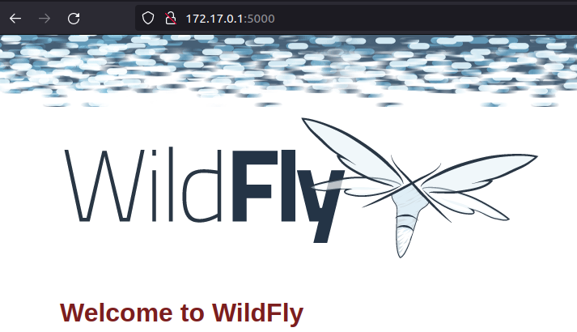

# **Instalación de Wildfly en Docker**

## **Índice**
[Descarga de la imagen](#id1)

## **Descarga de la imagen**<a name = "id1"></a>
Lo primero que haremos será descargar nuestra imagen.

```bash
daw@DLP17-Lubuntu18:~$ sudo docker pull jboss/wildfly:25.0.0.Final
[sudo] contraseña para daw: 
25.0.0.Final: Pulling from jboss/wildfly
f87ff222252e: Pull complete 
13776e8da872: Pull complete 
0b43aea4eeb1: Pull complete 
8116b2f7ca5a: Pull complete 
f26d32e28c29: Pull complete 
Digest: sha256:35320abafdec6d360559b411aff466514d5741c3c527221445f48246350fdfe5
Status: Downloaded newer image for jboss/wildfly:25.0.0.Final
docker.io/jboss/wildfly:25.0.0.Final
```

Verificamos el listado de imagenes.

```bash
daw@DLP17-Lubuntu18:~$ sudo docker images
REPOSITORY      TAG            IMAGE ID       CREATED       SIZE
jboss/wildfly   25.0.0.Final   856694040847   3 weeks ago   736MB
hello-world     latest         feb5d9fea6a5   5 weeks ago   13.3kB
```

Ahora arrancaremos el contenedor y comprobamos la disponibilidad del servidor.

```bash
daw@DLP17-Lubuntu18:~$ sudo docker run -d -p 5000:8080 --name "servidor-desa" jboss/wildfly
Unable to find image 'jboss/wildfly:latest' locally
latest: Pulling from jboss/wildfly
Digest: sha256:35320abafdec6d360559b411aff466514d5741c3c527221445f48246350fdfe5
Status: Downloaded newer image for jboss/wildfly:latest
b7bf1ea817681466a0fb61ab5df13f2b88579ee1c0c3bbfe093bdf3919ab5ecb
```

Lanzaremos el comando **ip a** y buscaremos la salida de Docker.

```bash
3: docker0: <BROADCAST,MULTICAST,UP,LOWER_UP> mtu 1500 qdisc noqueue state UP group default 
    link/ether 02:42:41:84:6e:f7 brd ff:ff:ff:ff:ff:ff
    inet 172.17.0.1/16 brd 172.17.255.255 scope global docker0
       valid_lft forever preferred_lft forever
    inet6 fe80::42:41ff:fe84:6ef7/64 scope link 
       valid_lft forever preferred_lft forever
```

Ahora si accedemos en un navegador a **172.17.0.1:5000** veremos la pantalla de bienvenida de WildFly.

