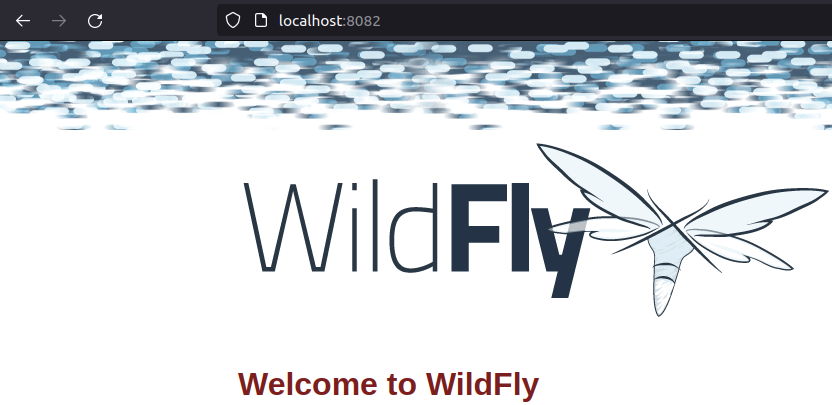

# **Modificando y Clusterizando un Servicio Rest en Wildfly**

## **Índice**
[Requerimientos](#id1)<br>
[Creación](#id2)<br>
[Verificación](#id3)

## **Requerimientos**<a name = "id1"></a>
- Imagen de **WildFly**.
- Cluster de 3 nodos en **WildFly**.
- Instalación de **BBDD** y **PHPMyAdmin**.
- Haremos uso de **Docker Compose**.

## **Creación**<a name = "id2"></a>
Crearemos la estructura del proyecto.

```bash
daw@DLP17-Lubuntu18:~/Desktop/Rest$ tree
.
├── conf
│   ├── docker-compose.yml
│   └── Dockerfile
├── dump
│   └── data.sql
└── www
    └── index.php
```

Creamos el fichero **Dockerfile**.

```bash
FROM php:8.0.0-apache
ARG DEBIAN_FRONTEND=noninteractive
RUN docker-php-ext-install mysqli
RUN apt-get update \
    && apt-get install -y libzip-dev \
    && apt-get install -y zlib1g-dev \
    && rm -rf /var/lib/apt/lists/* \
    && docker-php-ext-install zip

RUN a2enmod rewrite

FROM jboss/wildfly

ARG WAR_FILE=target/*.war

ADD ${ARG} /opt/jboss/wildfly/standalone/deployments/

ARG WILDFLY_NAME
ARG CLUSTER_PW

ENV WILDFLY_NAME=${WILDFLY_NAME}
ENV CLUSTER_PW=${CLUSTER_PW}

ENTRYPOINT /opt/jboss/wildfly/bin/standalone.sh -b=0.0.0.0 -bmanagement=0.0.0.0 -Djboss.server.default.config=standalone-full-ha.xml -Djboss.node.name=${WILDFLY_NAME} -Djava.net.preferIPv4Stack=true -Djgroups.bind_addr=$(hostname -i) -Djboss.messaging.cluster.password=${CLUSTER_PW}
```

Creamos el fichero **docker-compose.yml**.

```bash
version : "3.5"
services :
  wildfly1 :
    build :
      context : .
      args :
        WILDFLY_NAME : wildfly_1
        CLUSTER_PW : secret_password
    image : wildfly_1
    ports :
      - 8080:8080
    networks :
      - default

  wildfly2 :
      build :
        context : .
        args :
          WILDFLY_NAME : wildfly_2
          CLUSTER_PW : secret_password
      image : wildfly_2
      ports :
        - 8081:8080
      networks :
        - default

  wildfly3 :
      build :
        context : .
        args :
          WILDFLY_NAME : wildfly_2
          CLUSTER_PW : secret_password
      image : wildfly_2
      ports :
        - 8083:8080
      networks :
        - default

  www :
      build : .
      ports :
        - 8084:8080
      volumes :
        - ./www:/var/www/html
      links :
        - db
      networks :
        - default
  db :
      image : mysql:8.0
      ports :
        - "3306:3306"
      command : --default-authentication-plugin=mysql_native_password
      environment :
        MYSQL_DATABASE : dbname
        MYSQL_USER : daw
        MYSQL_PASSWORD : test
        MYSQL_ROOT_PASSWORD : test
      volumes :
        - ./dump:/docker-entrypoint-initdb.d
        - ./conf:/etc/mysql/conf.d
        - persistent:/var/lib/mysql
      networks :
        - default
  phpmyadmin :
      image : phpmyadmin/phpmyadmin
      links :
        - db:db
      ports :
        - 8000:80
      environment :
        MYSQL_USER : daw
        MYSQL_PASSWORD : test
        MYSQL_ROOT_PASSWORD : test
volumes :
  persistent :


  www :
      build : .
      ports :
        - "8082:8081"
      volumes :
        - ./www:/var/www/html
      links :
        - db
      networks :
        - default
  db :
      image : mysql:8.0
      ports :
        - "3306:3306"
      command : --default-authentication-plugin=mysql_native_password
      environment :
        MYSQL_DATABASE : dbname
        MYSQL_USER : daw
        MYSQL_PASSWORD : test
        MYSQL_ROOT_PASSWORD : test
      volumes :
        - ./dump:/docker-entrypoint-initdb.d
        - ./conf:/etc/mysql/conf.d
        - persistent:/var/lib/mysql
      networks :
        - default
  phpmyadmin :
      image : phpmyadmin/phpmyadmin
      links :
        - db:db
      ports :
        - 8000:80
      environment :
        MYSQL_USER : daw
        MYSQL_PASSWORD : test
        MYSQL_ROOT_PASSWORD : test
volumes :
  persistent :
```

Creamos el fichero **data.sql**.

```bash
  SET SQL_MODE = "NO_AUTO_VALUE_ON_ZERO";
  SET time_zone = "+00:00";

  /*!40101 SET @OLD_CHARACTER_SET_CLIENT=@@CHARACTER_SET_CLIENT */;
  /*!40101 SET @OLD_CHARACTER_SET_RESULTS=@@CHARACTER_SET_RESULTS */;
  /*!40101 SET @OLD_COLLATION_CONNECTION=@@COLLATION_CONNECTION */;
  /*!40101 SET NAMES utf8mb4 */;

  CREATE TABLE `Data` (
    `id` int(11) NOT NULL,
    `name` varchar(20) NOT NULL
  ) ENGINE=InnoDB DEFAULT CHARSET=latin1;

  INSERT INTO `Data` (`id`, `name`) VALUES (1, 'OpenWebinars Article'), (2, 'Crashell'), (3, 'Jerson Martinez'), (4, 'Antonio Moreno');

  /*!40101 SET CHARACTER_SET_CLIENT=@OLD_CHARACTER_SET_CLIENT */;
  /*!40101 SET CHARACTER_SET_RESULTS=@OLD_CHARACTER_SET_RESULTS */;
  /*!40101 SET COLLATION_CONNECTION=@OLD_COLLATION_CONNECTION */;
```

Arrancamos el contenedor.

```bash
daw@DLP17-Lubuntu18:~/Desktop/Rest/conf$ docker-compose up -d
Starting conf_db_1       ... done
Starting conf_wildfly3_1 ... done
Starting conf_wildfly1_1 ... done
Starting conf_wildfly2_1 ... done
Starting conf_phpmyadmin_1 ... done
Starting conf_www_1        ... done
```

## **Verificación**<a name = "id3"></a>
Comprobamos que todos los servicios están arrancados.

```bash
daw@DLP17-Lubuntu18:~/Desktop/Rest/conf$ docker-compose ps
      Name                     Command               State                          Ports                       
----------------------------------------------------------------------------------------------------------------
conf_db_1           docker-entrypoint.sh --def ...   Up      0.0.0.0:3306->3306/tcp,:::3306->3306/tcp, 33060/tcp
conf_phpmyadmin_1   /docker-entrypoint.sh apac ...   Up      0.0.0.0:8000->80/tcp,:::8000->80/tcp               
conf_wildfly1_1     /bin/sh -c /opt/jboss/wild ...   Up      0.0.0.0:8080->8080/tcp,:::8080->8080/tcp           
conf_wildfly2_1     /bin/sh -c /opt/jboss/wild ...   Up      0.0.0.0:8081->8080/tcp,:::8081->8080/tcp           
conf_wildfly3_1     /bin/sh -c /opt/jboss/wild ...   Up      0.0.0.0:8082->8080/tcp,:::8082->8080/tcp           
conf_www_1          /bin/sh -c /opt/jboss/wild ...   Up      0.0.0.0:8083->8080/tcp,:::8083->8080/tcp 
```

Comprobamos el primer WildFly.


Comprobamos el segundo WildFly.


Comprobamos el tercer WildFly.



Comprobamos PHPMyAdmin.


Y nos logeamos correctamente.

