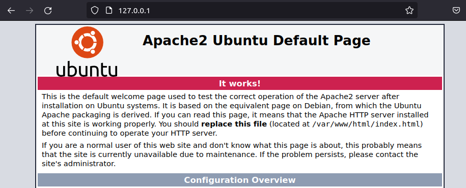
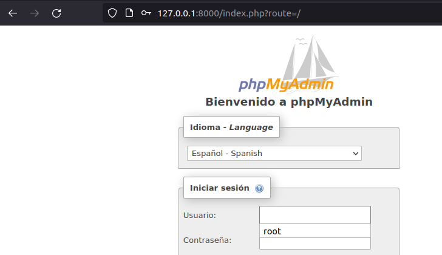
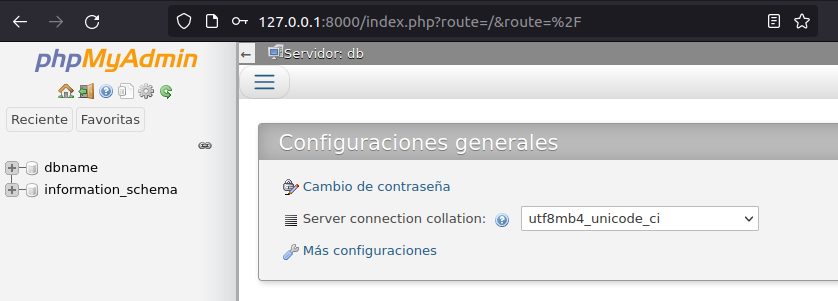

# **Infraestructura LAMP en Docker**

## **Índice**
[Creación](#id1)<br>
[Verificación](#id2)

## **Creación**<a name = "id1"></a>
Lo primero que haremos será crear la estructura del proyecto.

```bash
daw@DLP17-Lubuntu18:~/Desktop/lamp$ tree
.
├── conf
│   ├── docker-compose.yml
│   └── Dockerfile
├── dump
│   └── data.sql
└── www
    └── index.php
```

Ahora crearemos el fichero **Dockerfile**.

```bash
FROM php:8.0.0-apache
ARG DEBIAN_FRONTEND=noninteractive
RUN docker-php-ext-install mysqli
RUN apt-get update \
    && apt-get install -y libzip-dev \
    && apt-get install -y zlib1g-dev \
    && rm -rf /var/lib/apt/lists/* \
    && docker-php-ext-install zip

RUN a2enmod rewrite
```

Y también crearemos el fichero **docker-compose.yml**.

```bash
version: "3.5"
services:
    www:
        build: .
        ports:
            - "8081:8081"
        volumes:
            - ./www:/var/www/html
        links:
            - db
        networks:
            - default
    db:
        image: mysql:8.0
        ports:
            - "3306:3306"
        command: --default-authentication-plugin=mysql_native_password
        environment:
            MYSQL_DATABASE: dbname
            MYSQL_USER: daw
            MYSQL_PASSWORD: test
            MYSQL_ROOT_PASSWORD: test
        volumes:
            - ./dump:/docker-entrypoint-initdb.d
            - ./conf:/etc/mysql/conf.d
            - persistent:/var/lib/mysql
        networks:
            - default
    phpmyadmin:
        image: phpmyadmin/phpmyadmin
        links:
            - db:db
        ports:
            - 8000:80
        environment:
            MYSQL_USER: daw
            MYSQL_PASSWORD: test
            MYSQL_ROOT_PASSWORD: test
volumes:
    persistent:
```

Luego creamos el fichero **data.sql**.

```bash
SET SQL_MODE = "NO_AUTO_VALUE_ON_ZERO";
  SET time_zone = "+00:00";

  /*!40101 SET @OLD_CHARACTER_SET_CLIENT=@@CHARACTER_SET_CLIENT */;
  /*!40101 SET @OLD_CHARACTER_SET_RESULTS=@@CHARACTER_SET_RESULTS */;
  /*!40101 SET @OLD_COLLATION_CONNECTION=@@COLLATION_CONNECTION */;
  /*!40101 SET NAMES utf8mb4 */;

  CREATE TABLE `Data` (
    `id` int(11) NOT NULL,
    `name` varchar(20) NOT NULL
  ) ENGINE=InnoDB DEFAULT CHARSET=latin1;

  INSERT INTO `Data` (`id`, `name`) VALUES (1, 'OpenWebinars Article'), (2, 'Crashell'), (3, 'Jerson Martinez'), (4, 'Antonio Moreno');

  /*!40101 SET CHARACTER_SET_CLIENT=@OLD_CHARACTER_SET_CLIENT */;
  /*!40101 SET CHARACTER_SET_RESULTS=@OLD_CHARACTER_SET_RESULTS */;
  /*!40101 SET COLLATION_CONNECTION=@OLD_COLLATION_CONNECTION */;
```

Y por último el fichero **index.php**.

```bash
<html>
    <head>
        <title>Welcome to LAMP Infrastructure</title>
        <meta charset="utf-8">
        <link rel="stylesheet" href="http://maxcdn.bootstrapcdn.com/bootstrap/3.3.6/css/bootstrap.min.css">
        <script src="http://maxcdn.bootstrapcdn.com/bootstrap/3.3.6/js/bootstrap.min.js"></script>
    </head>
    <body>
        <div class="container-fluid">
          
            <?php
                echo "<h1>¡Hola, soy Alumno y te da la bienvenida!</h1>";

                $conn = mysqli_connect('db', 'root', 'test', "dbname");
                $query = 'SELECT * From Data';
                $result = mysqli_query($conn, $query);

                echo '<table class="table table-striped">';
                echo '<thead><tr><th></th><th>id</th><th>name</th></tr></thead>';
                while($value = $result->fetch_array(MYSQLI_ASSOC)){
                    echo '<tr>';
                    echo '<td><a href="#"><span class="glyphicon glyphicon-search"></span></a></td>';
                    foreach($value as $element){
                        echo '<td>' . $element . '</td>';
                    }

                    echo '</tr>';
                }
                echo '</table>';

                $result->close();
                mysqli_close($conn);
            ?>
        </div>
    </body>
</html>
```

## **Verificación**<a name = "id2"></a>
Para verificar haremos lo siguiente:

```bash
daw@DLP17-Lubuntu18:~/Desktop/lamp/conf$ docker-compose up -d --build
Creating network "conf_default" with the default driver
Building www
Sending build context to Docker daemon  4.608kB
```

Tendremos un problema con **conf_db_1**.

```bash
daw@DLP17-Lubuntu18:~/Desktop/lamp/conf$ docker-compose ps
      Name                     Command               State                         Ports                      
--------------------------------------------------------------------------------------------------------------
conf_db_1           docker-entrypoint.sh --def ...   Exit 1                                                   
conf_phpmyadmin_1   /docker-entrypoint.sh apac ...   Up       0.0.0.0:8000->80/tcp,:::8000->80/tcp            
conf_www_1          docker-php-entrypoint apac ...   Up       80/tcp, 0.0.0.0:8081->8081/tcp,:::8081->8081/tcp
```

Veremos los logs para saber el problema.

```bash
daw@DLP17-Lubuntu18:~/Desktop/lamp/conf$ docker logs conf_db_1 
2021-11-09 17:49:19+00:00 [Note] [Entrypoint]: Entrypoint script for MySQL Server 8.0.27-1debian10 started.
2021-11-09 17:49:19+00:00 [Note] [Entrypoint]: Switching to dedicated user 'mysql'
2021-11-09 17:49:19+00:00 [Note] [Entrypoint]: Entrypoint script for MySQL Server 8.0.27-1debian10 started.
2021-11-09 17:49:19+00:00 [ERROR] [Entrypoint]: MYSQL_USER="root", MYSQL_USER and MYSQL_PASSWORD are for configuring a regular user and cannot be used for the root user
    Remove MYSQL_USER="root" and use one of the following to control the root user password:
    - MYSQL_ROOT_PASSWORD
    - MYSQL_ALLOW_EMPTY_PASSWORD
    - MYSQL_RANDOM_ROOT_PASSWORD
```

Para arreglarlo, tendremos que cambiar el nombre de usuario de la base de datos.

Iremos a la dirección **127.0.0.1** y veremos lo siguiente:



También iremos a la dirección **127.0.0.1:8000** y veremos el login de PHPmyadmin.



Nos logearemos con el usuario y nos dará acceso a este.

