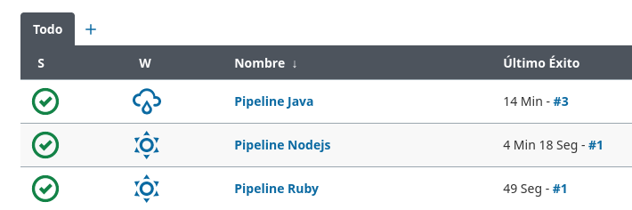

# **Creación de los Pipeline en distintos Lenguajes**

## **Índice**
[Creación de Pipeline en Java](#id1) 
[Creación de Pipeline en Nodejs](#id2) 
[Creación de Pipeline en Ruby](#id3) 
[Creación de Pipeline en Python](#id4) 
[Creación de Pipeline en PHP](#id5) 
[Creación de Pipeline en Go](#id6)

## **Creación de Pipeline en Java**
En el Panel de Control de Jenkins vamos a **Nueva Tarea**.

Lo siguiente será **ponerle nombre** y elegir el **tipo**.

Ahora incrustamos el script que quieres que ejecute el pipeline

Ejecutamos el pipeline, nos saldrá el siguiente error:

Para solucionar el error vamos al apartado de **Administrar plugins** de nuestro **Panel de control** y instalamos los siguientes Plugins.

Reiniciamos el servicio de Jenkins al terminar la instalación.

Al volver a ejecutar nos saldrá el siguiente error de permisos.

Para solucionarlo añadiremos el usuario **jenkins** al grupo de **sudoers**.

Volveremos a ejecutar el pipeline, y ahora sí que se ejecutará correctamente.

## **Creación de Pipeline en Nodejs**
Como en el punto anterior iremos a **Nueva tarea** y le ponemos **nombre** y **tipo**.

Insertamos el script que ejecutará nuestro pipeline.

Ejecutamos el pipeline y se ejecutará correctamente.

## **Creación de Pipeline en Ruby**
Como en el punto anterior iremos a **Nueva tarea** y le ponemos **nombre** y **tipo**.

Insertamos el script que ejecutará nuestro pipeline.

Ejecutamos el pipeline y se ejecutará correctamente.

## **Creación de Pipeline en Python**
Como en el punto anterior iremos a **Nueva tarea** y le ponemos **nombre** y **tipo**.

Insertamos el script que ejecutará nuestro pipeline.

Ejecutamos el pipeline y se ejecutará correctamente.

## **Creación de Pipeline en PHP**
Como en el punto anterior iremos a **Nueva tarea** y le ponemos **nombre** y **tipo**.

Insertamos el script que ejecutará nuestro pipeline.

Ejecutamos el pipeline y se ejecutará correctamente.

## **Creación de Pipeline en Go**
Como en el punto anterior iremos a **Nueva tarea** y le ponemos **nombre** y **tipo**.

Insertamos el script que ejecutará nuestro pipeline.

Ejecutamos el pipeline y se ejecutará correctamente.

