## **Manipulación de repositorios de Git**

## **Índice** 
1. [Configuración](#id1)
2. [Creación de un repositorio](#id2)
3. [Comprobar el estado del repositorio](#id3)
4. [Realizando Commit´s](#id4)
5. [Modificación de ficheros](#id5)
6. [Historial](#id6)

### **Configuración**
Lo primero que haremos será la configuración de Git definiendo nuestro nombre de usuario y correo electrónico.

También activaremos el color de la salida de los comandos, mostraremos la configuración final luego de todo.

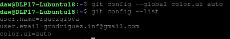

### **Creación de un repositorio**
Ahora crearemos el directorio **DPL**, nos moveremos a él e iniciaremos git, lanzamos el comando **ls -la** al final para ver que se han creado las dependencias de Git dentro.

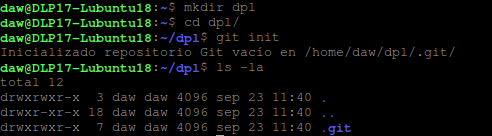

### **Comprobar el estado del repositorio**
Ahora comprobaremos el estado del repositorio.

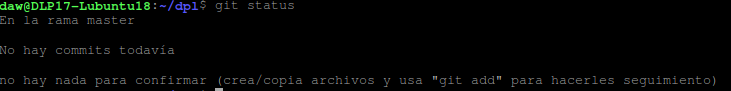

Crearemos el fichero **indice.txt**, y en él añadimos lo siguiente:

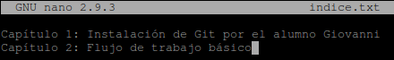

Guardaremos el contenido el fichero y volveremos a ver el estado del repositorio, veremos que se ha añadido a la lista de “Archivos sin seguimiento” el fichero que hemos creado.

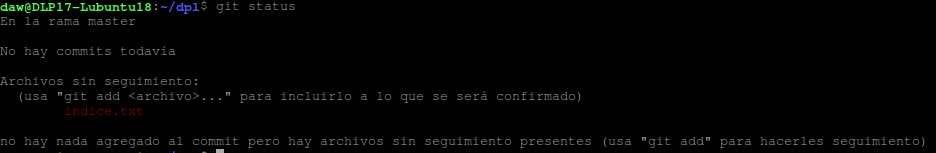

Ahora añadiremos el fichero a la zona de intercambio.

Y volveremos a comprobar el estado del repositorio, ahora como vemos, ya el cambio está esperando a ser confirmado.

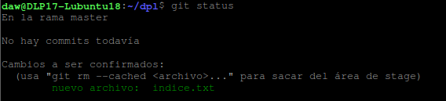

### **Realizando Commit´s**
En este paso lo primero que haremos será realizar un commit de los cambios realizados anteriormente con el mensaje “Añadido índice de la asignatura DPL.”.

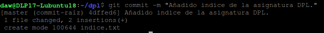

Luego de esto, veremos el estado del repositorio.

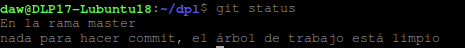

### **Modificación de ficheros**
Modificaremos el fichero creado anteriormente y le añadiremos lo siguiente:

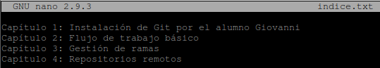

Ahora mostraremos los cambios en comparación a la última versión que existe en el repositorio, veremos los dos capítulos añadidos.

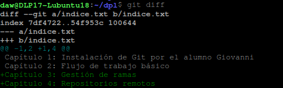

Por último añadiremos un nuevo commit con el mensaje “Añadido los capítulos 3  y 4”.

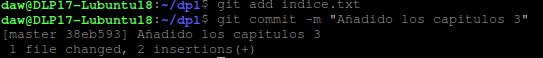

### **Historial**
En este paso mostraremos los cambios de la última versión subida al repositorio con respecto de la anterior.

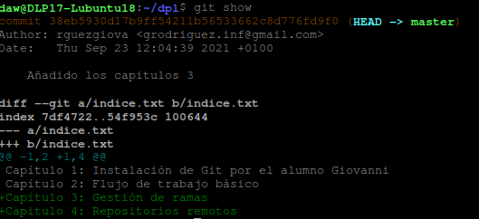

Lo próximo que haremos será cambiar el mensaje del último commit a “Añadido el capitulo sobre gestión de ramas al índice.”.

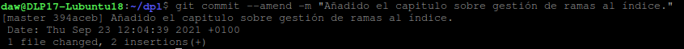

Por último volveremos a mostrar los cambios al repositorio.

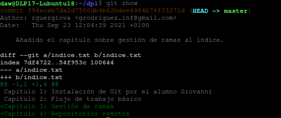
