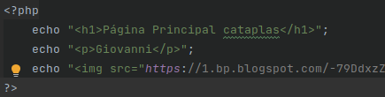
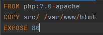
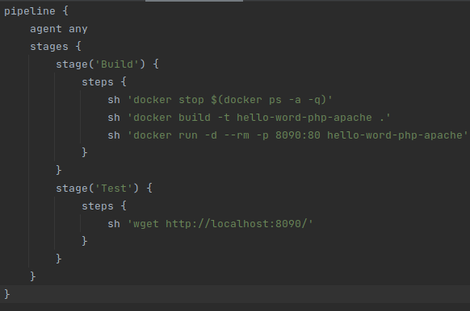
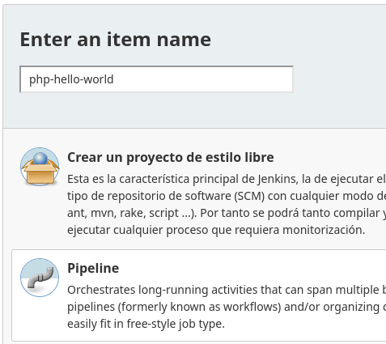
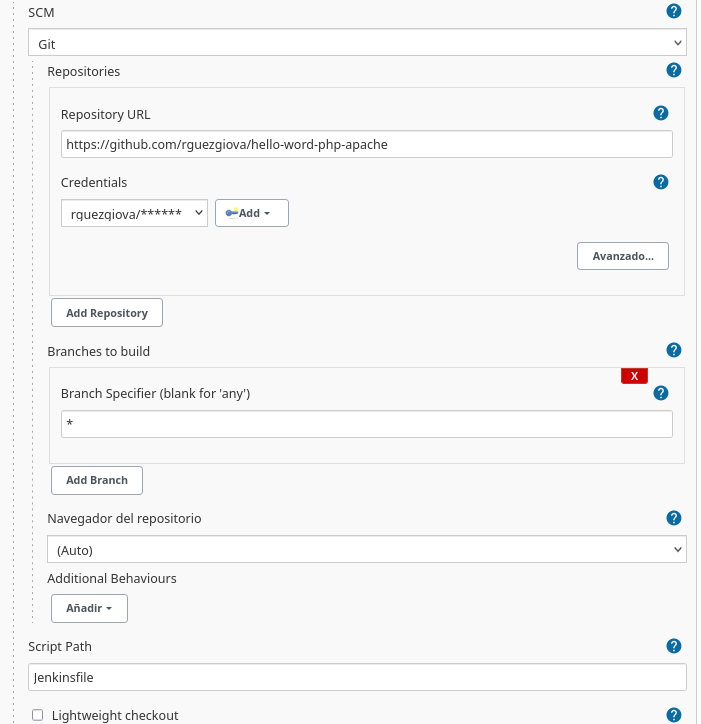
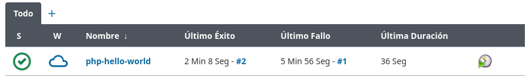
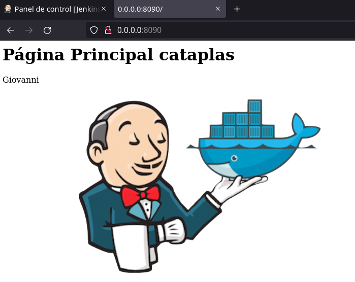

# **Creación de los Pipeline en Php**
    
## **Índice**
[Creación del repositorio y ficheros](#id1) 
[Creación del fichero Dockerfile](#id2) 
[Creación del fichero Jenkinsfile](#id3) 
[Creación del Pipeline](#id4) 
[Ejecución del Pipeline](#id5) 
[Comprobación](#id6)

## **Creación del repositorio y ficheros**
Lo primero que haremos será crear un nuevo repositorio en nuestro GitHub llamado **hello-word-php-apache**, dentro de él creamos el directorio **src** con lo siguiente.

## **Creación del fichero Dockerfile**
En este paso crearemos el fichero **Dockerfile** con lo siguiente:

## **Creación del fichero Jenkinsfile**
Ahora creamos el fichero **Jenkinsfile** con lo siguiente:

## **Creación del Pipeline**
Lo siguiente que haremos será crear la **Pipeline** para ello vamos al **Panel de control** de Jenkins y creamos una **Nueva tarea**, le ponemos **nombre** y **tipo**.

Seleccionamos la opción de **Git**, pegamos la **URL** de nuestro repositorio, escribimos nuestras credenciales de GitHub, de **Script Path** elegimos **Jenkinsfile** y por último **deseleccionamos** la opción de Checkout.

## **Ejecución del Pipeline**
En este paso ejecutaremos nuestro Pipeline creado, si todo ha ido bien debería ejecutarse correctamente.

## **Comprobación**
Por último para comprobar el correcto funcionamiento abrimos un navegador y escribimos en nuestro caso **0.0.0.0:8090** y veremos lo siguiente:

