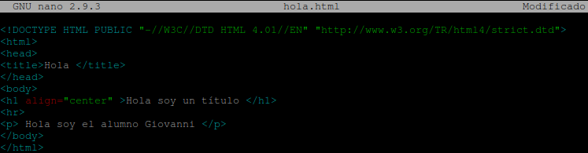
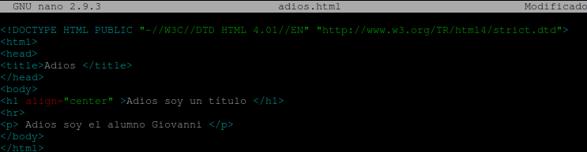

## **Ejercicio práctico**

Lo primero que haremos será inicializar un repositorio cuyo nombre será "ejercicio_git_giovanni_rodriguez_gomez".

```bash
daw@DLP17-Lubuntu18:~$ mkdir ejercicio_git_giovanni_rodriguez_gomez
daw@DLP17-Lubuntu18:~$ cd ejercicio_git_giovanni_rodriguez_gomez/
daw@DLP17-Lubuntu18:~/ejercicio_git_giovanni_rodriguez_gomez$ git init
Inicializado repositorio Git vacío en /home/daw/ejercicio_git_giovanni_rodriguez_gomez/.git/
```

Ahora añadimos el fichero **README.md** y realizaremos el primer commit.

```bash
daw@DLP17-Lubuntu18:~/ejercicio_git_giovanni_rodriguez_gomez$ nano README.md
```

Luego de esto realizaremos el primer commit.

```bash
daw@DLP17-Lubuntu18:~/ejercicio_git_giovanni_rodriguez_gomez$ git add .
daw@DLP17-Lubuntu18:~/ejercicio_git_giovanni_rodriguez_gomez$ git commit -m "Iniciacion del repositorio y creacion del fichero README.md"
[master (commit-raíz) cec498b] Iniciacion del repositorio y creacion del fichero README.md
 1 file changed, 1 insertion(+)
 create mode 100644 README.md
```

Ahora crearemos la rama **feaure-1**.

```bash
daw@DLP17-Lubuntu18:~/ejercicio_git_giovanni_rodriguez_gomez$ git branch feature-1
```

Ahora nos moveremos a la rama, dentro de esta creamos el fichero **hola.html** con lo siguiente.

```bash
daw@DLP17-Lubuntu18:~/ejercicio_git_giovanni_rodriguez_gomez$ git checkout feature-1
Cambiado a rama 'feature-1'
daw@DLP17-Lubuntu18:~/ejercicio_git_giovanni_rodriguez_gomez$ nano hola.html
```



Después nos volvemos a la rama **main** y creamos el fichero **adios.html** con lo siguiente:

```bash
daw@DLP17-Lubuntu18:~/ejercicio_git_giovanni_rodriguez_gomez$ git checkout master
Cambiado a rama 'master'
daw@DLP17-Lubuntu18:~/ejercicio_git_giovanni_rodriguez_gomez$ nano adios.html
```



Ahora realizamos la fusión de las ramas.

```bash
daw@DLP17-Lubuntu18:~/ejercicio_git_giovanni_rodriguez_gomez$ git merge feature-1
Ya está actualizado.
```

Ahora añadidos el commit y subimos los cambios al repositorio.

```bash
daw@DLP17-Lubuntu18:~/ejercicio_git_giovanni_rodriguez_gomez$ git commit -m "Añadido los ficheros hola.html y adios.html
> "
[master 1ce552c] Añadido los ficheros hola.html y adios.html
 2 files changed, 22 insertions(+)
 create mode 100644 adios.html
 create mode 100644 hola.html
```

Por último mostramos todos los cambios realizados en el repositorio.

```bash
daw@DLP17-Lubuntu18:~/ejercicio_git_giovanni_rodriguez_gomez$ git log --graph --all --oneline
* 1ce552c (HEAD -> master) Añadido los ficheros hola.html y adios.html
* cec498b (feature-1) Iniciacion del repositorio y creacion del fichero README.md
```
