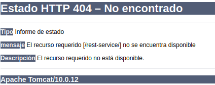

# **Servicios RESTful con Tomcat y Jersey**

## **Índice**
[Despliegue del servicio](#id1)<br>
[Consumo del servicio](#id2)<br>
[Problemas durante el despliegue](#id3)

## **Despliegue del servicio**<a name = "id1"></a>
Movemos el proyecto a la ruta de proyectos de Tomcat **webapps**.

```bash
daw@DLP17-Lubuntu18:~/Desktop/proyecto-rest$ sudo mv target/rest-service.war /opt/tomcat/apache-tomcat/webapps/
```

## **Consumo del servicio**<a name = "id2"></a>
Ahora para verificar iremos a la ruta **localhost:8085/rest/users**, veremos el siguiente error:



## **Problemas durante el despliegue**<a name = "id3"></a>
Durante el despliegue tendremos una serie de problemas, para visualizar que problemas tenemos está el directorio **logs** dentro de Tomcat, en él, veremos el fichero **localhost
.2021-10-18.log** con el siguiente contenido:

```bash
daw@DLP17-Lubuntu18:~$ sudo cat /opt/tomcat/apache-tomcat/logs/localhost.2021-10-18.log
18-Oct-2021 16:22:49.646 INFORMACIÓN [main] org.apache.catalina.core.ApplicationContext.log ContextListener: contextInitialized()
18-Oct-2021 16:22:49.646 INFORMACIÓN [main] org.apache.catalina.core.ApplicationContext.log SessionListener: contextInitialized()
18-Oct-2021 16:22:49.647 INFORMACIÓN [main] org.apache.catalina.core.ApplicationContext.log ContextListener: attributeAdded('StockTicker', 'async.Stockticker@4e4efc1b')
18-Oct-2021 16:58:16.392 INFORMACIÓN [Catalina-utility-2] org.apache.catalina.core.ApplicationContext.log Marcando el servlet [Jersey Web Application] como no disponible
18-Oct-2021 16:58:16.393 GRAVE [Catalina-utility-2] org.apache.catalina.core.StandardContext.loadOnStartup Servlet [Jersey Web Application] in web application [/rest-service] threw load() exception
	java.lang.ClassNotFoundException: com.sun.jersey.spi.container.servlet.ServletContainer
```

Para solucionar dicho problema descargaremos
el jar de **org.glassfish.jersey.containers**, lo moveremos al directorio **lib**.

```bash
daw@DLP17-Lubuntu18:~$ sudo mv Descargas/jersey-client-2.35.jar /opt/tomcat/apache-tomcat/lib/
```

Luego de esto nos saldrá otro error llamando **javax.servlet.Filter**.

```bash
daw@DLP17-Lubuntu18:/home/daw# cat /opt/tomcat/apache-tomcat/logs/localhost.2021-10-19.log 
19-Oct-2021 17:48:11.643 INFORMACIÓN [main] org.apache.catalina.core.ApplicationContext.log Marcando el servlet [Jersey Web Application] como no disponible
19-Oct-2021 17:48:11.645 GRAVE [main] org.apache.catalina.core.StandardContext.loadOnStartup Servlet [Jersey Web Application] in web application [/rest-service] threw load() exception
	java.lang.ClassNotFoundException: javax.servlet.Filter
```

Indagando en este error no he llegado a encontrar la solución.